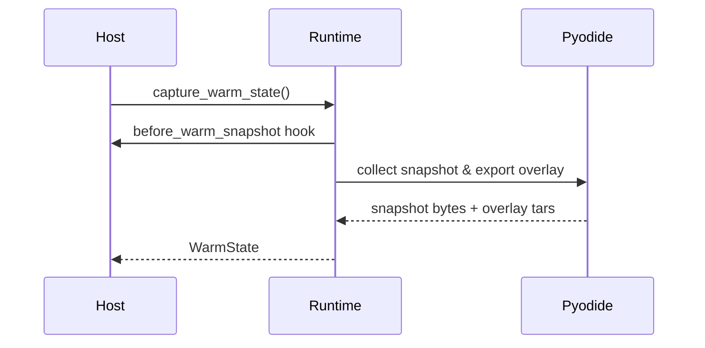
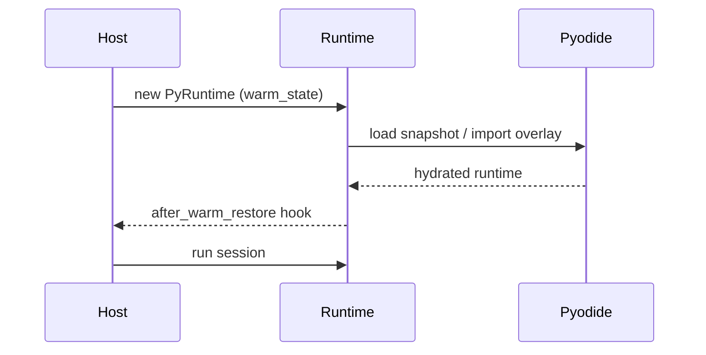

# Host Integration (Rust)

This guide shows how to embed `aardvark-core` in a Rust service. It covers runtime setup, bundle execution, pooling, and error handling. Everything here is **experimental** and likely to change; use it for prototypes rather than production traffic.

The same surface runs JavaScript bundles: set `InvocationDescriptor::runtime.language` or add `"runtime": {"language": "javascript"}` to the manifest. JavaScript bundles must ship their own modules; the runtime never resolves npm packages.

## Adding the dependency

```toml
[dependencies]
aardvark-core = { path = "crates/aardvark-core" }
```

For crates.io you will depend on the published version instead of the workspace path.

## Preparing [Pyodide](https://pyodide.org/) assets

Before initialising a Python runtime, stage the pinned Aardvark Pyodide
distribution on disk. The distribution contains the upstream Pyodide 0.29.4
runtime files, package files, Aardvark adapter scripts, a manifest, and a
compatibility fingerprint.

Use the CLI helper:

```bash
cargo run -p aardvark-cli -- assets stage --variant full
cargo run -p aardvark-cli -- assets verify \
  .aardvark/pyodide-distributions/aardvark-0.1.1-pyodide-v0.29.4-full
```

Then either set `AARDVARK_PYODIDE_DIST_DIR` or configure the runtime directly:

```rust
let config = PyRuntimeConfig::default()
    .with_pyodide_dist_dir(".aardvark/pyodide-distributions/aardvark-0.1.1-pyodide-v0.29.4-full");
```

The `core` variant is useful for runtimes that do not need the full wheel set.
Package loading is resolved exclusively through the verified distribution; flat
wheel-cache directories are not a supported runtime contract.

For workload-specific distributions, register profile labels and let bundle
manifests request them through `runtime.pyodide.profile`:

```rust
use aardvark_core::{BundleArtifact, BundlePool, IsolateConfig, PoolOptions, PyRuntimeConfig};

let runtime = PyRuntimeConfig::default()
    .with_pyodide_distribution_profile_dir(
        "blas",
        ".aardvark/pyodide-distributions/aardvark-0.1.1-pyodide-v0.29.4-blas",
    )?;

let artifact = BundleArtifact::from_bytes(bundle_bytes)?;
let pool = BundlePool::from_artifact(
    artifact,
    PoolOptions {
        isolate: IsolateConfig {
            runtime,
            ..IsolateConfig::default()
        },
        ..PoolOptions::default()
    },
)?;
```

Profile selection happens before isolate creation. For services that accept many
ZIP bundles, use `BundlePoolRegistry` so the host automatically routes each
bundle/profile pair to its own warmed pool:

```rust
use aardvark_core::{
    BundlePoolRegistry, IsolateConfig, PoolOptions, PyRuntimeConfig,
};

let runtime = PyRuntimeConfig::default()
    .with_pyodide_distribution_profile_dir(
        "blas",
        ".aardvark/pyodide-distributions/aardvark-0.1.1-pyodide-v0.29.4-blas",
    )?;
let registry = BundlePoolRegistry::new(PoolOptions {
    isolate: IsolateConfig {
        runtime,
        ..IsolateConfig::default()
    },
    desired_size: 2,
    max_size: 8,
    ..PoolOptions::default()
})?;

let prepared = registry.prepare_default_handler_for_bytes(bundle_bytes)?;
let outcome = prepared.call_default()?;
```

The registry key includes the normalised bundle fingerprint and the
manifest-requested Pyodide profile. That means a `default` workload and a
`blas` workload can stay hot at the same time without asking one isolate or
warm snapshot to switch distributions per call. `pool_for_bytes` also caches
the normalised bundle artifact by a digest of the ZIP bytes, so repeated calls
with the same bundle do not reparse the archive before hitting the warmed pool.
Package roots are runtime-local, so concurrent runtimes using different staged
Pyodide distributions do not race through a process-global package directory.
Use `prepare_default_handler_for_bytes` or `prepare_handler_for_bytes` on hot
request paths so the registry also caches handler sessions and avoids repeated
handler prewarm work. For the lowest latency, call it during deploy/startup and
retain the returned `PreparedBundleHandler`; request handlers can then call
`prepared.call_json(...)`, `prepared.call_rawctx(...)`, or
`prepared.call_default()` without re-hashing the ZIP bytes or touching the
registry maps. For binary tensor-like workloads, combine the retained handler
with owned `RawCtxInput` values so the request path stays on the direct RawCtx
contract instead of materialising JSON.

For one-shot direct runtime usage, construct the runtime from the bundle so the
manifest profile is applied before Pyodide starts:

```rust
let bundle = aardvark_core::Bundle::from_zip_bytes(bundle_bytes)?;
let runtime_config = PyRuntimeConfig::default()
    .with_pyodide_distribution_profile_dir(
        "blas",
        ".aardvark/pyodide-distributions/aardvark-0.1.1-pyodide-v0.29.4-blas",
    )?;
let mut runtime = aardvark_core::PyRuntime::new_for_bundle(runtime_config, &bundle)?;
let (session, _) = runtime.prepare_session_with_manifest(bundle)?;
let outcome = runtime.run_session(&session)?;
```

## Persistent isolates (`PythonIsolate`)

```rust
use aardvark_core::{
    persistent::{BundleArtifact, BundleHandle, HandlerSession, PythonIsolate},
    IsolateConfig,
};

fn build_isolate(bytes: &[u8]) -> anyhow::Result<(PythonIsolate, HandlerSession)> {
    let artifact = BundleArtifact::from_bytes(bytes)?;
    let handle = BundleHandle::from_artifact(artifact.clone());

    let mut isolate = PythonIsolate::new(IsolateConfig::default())?;
    isolate.load_bundle(&handle)?; // optional warm-up

    let handler = handle.prepare_default_handler();
    Ok((isolate, handler))
}

fn invoke(handler: &HandlerSession, isolate: &mut PythonIsolate) -> anyhow::Result<()> {
    let outcome = handler.invoke(isolate)?;
    if outcome.is_success() {
        tracing::info!(stdout = %outcome.diagnostics.stdout);
    } else {
        tracing::warn!(?outcome.status, "handler failed");
    }
    Ok(())
}
```

If bundle manifests can request `runtime.pyodide.profile`, prefer
`BundlePool`/`BundlePoolRegistry` or configure `IsolateConfig.runtime` with the
selected profile before `PythonIsolate::new`. `load_bundle` can validate the
profile on an existing isolate, but it cannot swap the Pyodide distribution
after the isolate has been created.

Key knobs via `IsolateConfig` / `PyRuntimeConfig`:

- `snapshot.load_from` / `snapshot.save_to` – warm snapshot management.
- `cleanup` – choose between full cleanup, shared-buffer-only scrubbing, or no automatic cleanup. `IsolateConfig::default()` uses full cleanup; latency-sensitive warmed hosts should opt into `CleanupMode::SharedBuffersOnly` only when retaining Python module state between calls is acceptable for that bundle/tenant boundary.
- `budget_override` – clamp descriptor limits globally.
- `host_capabilities` – capability allowlist applied to every call unless a manifest narrows it further.
- `pyodide_dist_dir` – override the staged Aardvark Pyodide distribution path
  without relying on process-wide environment variables.

### Inline Python without a bundle

```rust
use aardvark_core::{
    BundleArtifact, BundleHandle, InlinePythonOptions, IsolateConfig, ManifestCpuResources,
    ManifestResources, PythonIsolate,
};

let mut isolate = PythonIsolate::new(IsolateConfig::default())?;
let mut options = InlinePythonOptions::default();
options.entrypoint = Some("main:handler".into());
options.packages = vec!["numpy".into()];
options.resources = Some(ManifestResources {
    cpu: Some(ManifestCpuResources { default_limit_ms: Some(3_000) }),
    ..Default::default()
});

let script = r#"
import numpy as np

def handler(user: str = "world"):
    return f"hi {user}, numpy={np.__name__}"
"#;

let outcome = isolate.run_inline_python_with_options(script, options)?;
assert_eq!(outcome.payload().unwrap().kind(), "text");
```

`InlinePythonOptions` produces a manifest next to the inline module so you can request packages, tweak resource policies, or target a specific Pyodide build. `PythonIsolate::run_inline_python` remains as a shorthand for the default `main:handler` entrypoint without any extra manifest hints.

If you want to reuse the inline handler across isolates or pools, build a `BundleArtifact` directly:

```rust
let artifact = BundleArtifact::from_inline_python(script, InlinePythonOptions::default())?;
let handle = BundleHandle::from_artifact(artifact.clone());
let handler = handle.prepare_default_handler();
let mut isolate = PythonIsolate::new(IsolateConfig::default())?;
isolate.load_bundle(&handle)?;
let outcome = handler.invoke(&mut isolate)?;
```

This path keeps a normalised manifest and fingerprint so pooling, caching, and descriptor overrides work exactly the same way as ZIP-backed bundles.

## Pooling (`BundlePool`)

```rust
use std::sync::Arc;

use aardvark_core::persistent::{
    BundleArtifact, BundlePool, LifecycleHooks, PoolOptions, QueueMode,
};

fn pooled_calls(bytes: &[u8]) -> anyhow::Result<()> {
    let artifact = BundleArtifact::from_bytes(bytes)?;
    let pool = BundlePool::from_artifact(
        artifact.clone(),
        PoolOptions {
            desired_size: 2,
            max_size: 4,
            max_queue: Some(32),
            queue_mode: QueueMode::Block,
            heap_limit_kib: Some(256 * 1024),
            memory_limit_kib: Some(512 * 1024),
            lifecycle_hooks: Some(LifecycleHooks {
                on_isolate_started: Some(Arc::new(|id, _cfg| tracing::debug!(isolate_id = id, "started"))),
                on_isolate_recycled: Some(Arc::new(|id, reason| {
                    tracing::debug!(isolate_id = id, ?reason, "recycled")
                })),
                ..Default::default()
            }),
            ..PoolOptions::default()
        },
    )?;

    let handler = pool.prepare_default_handler()?;

    for _ in 0..4 {
        let outcome = pool.call_default(&handler)?;
        tracing::info!(
            queue_wait_ms = outcome.diagnostics.queue_wait_ms,
            heap_kib = outcome.diagnostics.py_heap_kib,
        );
    }

    let stats = pool.stats();
    tracing::info!(
        invocations = stats.invocations,
        avg_ms = stats.average_queue_wait_ms,
        p95_ms = stats.queue_wait_p95_ms,
        quarantine_events = stats.quarantine_events,
        scaledown_events = stats.scaledown_events,
    );
    Ok(())
}
```

Key `PoolOptions` knobs:

- **Concurrency** – `desired_size` (initial isolates) and `max_size` (upper bound). Calls queue when all isolates are busy; hosts can adjust concurrency at runtime via `BundlePool::set_desired_size` or `BundlePool::resize`.
- **Queueing behaviour** – `queue_mode::Block` waits until an isolate is free; `queue_mode::FailFast` surfaces `PoolQueueFull` immediately. `max_queue` caps queued calls.
- **Resource guard rails** – `heap_limit_kib` and `memory_limit_kib` quarantine isolates that exceed the configured budgets.
- **Lifecycle hooks** – `LifecycleHooks` expose `on_isolate_started`, `on_isolate_recycled`, `on_call_started`, and `on_call_finished` so hosts can attach custom monitoring.
  `on_isolate_recycled` receives a `RecycleReason` so you can distinguish between normal reuse, guard-rail quarantines, scale downs, and shutdowns.
- **Telemetry flushing** – `telemetry_interval` controls the background reporter that logs queue depth/percentiles to `tracing` (`aardvark::telemetry`). Set it to `None` to disable periodic emission if you prefer to poll stats manually.

`prepare_default_handler` and `prepare_handler` prewarm handler imports and
adapters without executing caller code. If startup is allowed to pay a real,
side-effecting Python invocation before live traffic, call
`warm_default`, `warm_json`, or `warm_rawctx` with a representative payload after
preparing the handler. Warm calls go through the same pool queueing, telemetry,
cleanup, and sandbox policy path as live calls, so only use them for idempotent
or explicitly safe warmup inputs.

For multi-isolate pools, use `warm_all_default`, `warm_all_json`, or
`warm_all_rawctx` during deploy/startup warmup. These execute the representative
handler once on every currently-created idle isolate after ensuring the desired
pool size exists. On lazy pools (`desired_size = 0`) an explicit warm-all creates
one isolate; set `desired_size` to the intended steady-state worker count first
when every worker should be paid for before accepting traffic. The same methods
are available on retained `PreparedBundleHandler` values returned by
`BundlePoolRegistry`.

For expensive package stacks such as NumPy, prefer staging readiness explicitly
instead of always warming full capacity. A pool with `desired_size = 1` and
`max_size = N` makes one fully warmed Pyodide/V8 isolate ready for live traffic
while preserving later scale-out capacity. A lazy pool (`desired_size = 0`) plus
an explicit retained-handler `warm_all_*` call similarly creates and warms one
isolate. This cuts deploy-to-first-ready time when the host can tolerate a later
request paying to create the next isolate; use eager `desired_size = N` only when
every worker must be hot before traffic starts.

For services that want the optimized startup sequence as a single host object,
use `WarmedBundleHost`. It parses the ZIP, prepares the handler, optionally runs
a representative warm-all call, and then exposes live `call_*` methods:

```rust
use aardvark_core::{
    IsolateConfig, JsonInput, PoolOptions, WarmedBundleHost, WarmedBundleHostOptions,
    WarmedBundleHostWarmup,
};

let f32_payload = bytes::Bytes::from(vec![0; 1024 * std::mem::size_of::<f32>()]);
let warm_input = Some(JsonInput::F32LeBytes(f32_payload.clone()));
let pool_options = PoolOptions {
    isolate: IsolateConfig::default(),
    desired_size: 1,
    max_size: 1,
    ..PoolOptions::default()
};

let host = WarmedBundleHost::from_bytes(
    bundle_bytes,
    WarmedBundleHostOptions::pooled(pool_options)
        .with_warmup(WarmedBundleHostWarmup::json_input(warm_input)),
)?;

let outcome = host.call_json_input(Some(JsonInput::F32LeBytes(f32_payload)))?;
```

For long-running hosts that repeatedly see the same bundle, use
`WarmedBundleHostRegistry` instead of building a new `WarmedBundleHost` per
request. The registry caches the parsed artifact and the fully prepared warmed
host for the configured descriptor/warmup template:

```rust
use aardvark_core::{
    IsolateConfig, PoolOptions, WarmedBundleHostOptions, WarmedBundleHostRegistry,
    WarmedBundleHostWarmup,
};

let registry = WarmedBundleHostRegistry::new(
    WarmedBundleHostOptions::pooled(PoolOptions {
        isolate: IsolateConfig::default(),
        desired_size: 1,
        max_size: 1,
        ..PoolOptions::default()
    })
    .with_warmup(WarmedBundleHostWarmup::default_call()),
);

let host = registry.prewarm_bytes(&bundle_bytes)?;
let outcome = host.call_default()?;

// Later request path:
if let Some(hot_host) = registry.ready_host_for_bytes(&bundle_bytes)? {
    let outcome = hot_host.call_default()?;
} else {
    // Return a service-level not-ready/miss response instead of starting
    // Pyodide/V8 on the live request path.
}
```

Create separate registries for different descriptor, backend, or warmup
contracts. The registry is intentionally a startup/live-call boundary: pay the
Pyodide/V8 and handler warmup cost once, then route live calls to the cached
host. Use `prewarm_many_bytes` when startup already knows the bundle set. Use
`ready_host_for_bytes` or `ready_host_for_artifact` on request paths that must
never trigger cold setup; use `host_for_bytes` only when cache-miss creation is
acceptable.

By default the registry is unbounded because many deploys know their bundle set
up front. Long-running multi-tenant hosts should set cache limits:

```rust
use aardvark_core::{
    PoolOptions, WarmedBundleHostOptions, WarmedBundleHostRegistry,
    WarmedBundleHostRegistryOptions,
};

let registry = WarmedBundleHostRegistry::with_options(
    WarmedBundleHostRegistryOptions::new(
        WarmedBundleHostOptions::pooled(PoolOptions::default()),
    )
    .with_max_ready_hosts(128)
    .with_max_artifacts(128),
);
```

The ready-host cache evicts least-recently used ready hosts when the limit is
exceeded. The artifact cache is the parse cache used by `ready_host_for_bytes`;
if an artifact is evicted, byte-based ready checks return `None` rather than
reparsing on the live path.

Use `remove_for_bytes` or `remove_for_artifact` when a tenant, deploy, or bundle
revision should be invalidated immediately. Use `clear` for deploy-wide or
profile-wide invalidation. These calls only remove already-ready warmed hosts;
they do not parse bundles or cancel an in-flight prewarm. A creation that
started before `clear` may still return a host to its original caller, but it is
not published into the cleared registry cache. After invalidation,
`ready_host_for_*` returns `None` until the host explicitly prewarms that bundle
again.

Use the pooled backend when the host can spend startup time before accepting
traffic. It keeps live calls on `BundlePool`, which has the mature queueing,
telemetry, resize, lifecycle hook, and guard-rail quarantine behavior. If many
workers need to be ready, set `desired_size` to the required count and prewarm at
deploy/startup; Aardvark intentionally keeps the live product path on the pooled
Pyodide/V8 host rather than adding an experimental channel-hop backend.

For RawCtx input hot paths, prefer owned buffers:
`RawCtxInput::from_vec("payload", bytes, metadata)`. Passing a cloned/shared
`Bytes` is still valid, but unique ownership gives the runtime the best chance
to transfer the allocation into V8 without an extra copy.

When using the direct RawCtx contract, pass `None` for input metadata unless
the handler reads it. Descriptor-bound RawCtx needs metadata for schema binding;
direct handlers usually own the protocol already, so unused metadata only adds
per-call serialisation and JS/Python conversion work.

If the direct handler only needs buffer views and never reads input metadata,
you can expose inputs as a flat `{name: memoryview}` mapping:

```rust
let descriptor = InvocationDescriptor::new("main:entrypoint")
    .with_rawctx_flat_input_buffers(true);
```

With this enabled, Python reads
`builtins.__aardvark_rawctx_inputs["payload"]` directly as a `memoryview`
instead of `{"data": memoryview, "metadata": ...}`. Do not enable it for
handlers that depend on the metadata-bearing record shape.

For hot handlers that never use stdout/stderr as part of the response contract,
you can disable stdio interception on the descriptor:

```rust
let descriptor = InvocationDescriptor::new("main:entrypoint")
    .with_capture_stdio(false);
```

This keeps Python execution inside Pyodide/V8, but skips per-call `StringIO`
allocation and `sys.stdout`/`sys.stderr` swapping. Diagnostics will return empty
`stdout` and `stderr` for that invocation, so keep the default capture mode for
script-like bundles, debugging, warnings, or any handler where printed output is
observable host data.

If output metadata is also redundant for a direct RawCtx contract, disable it on
the same descriptor:

```rust
let descriptor = InvocationDescriptor::new("main:entrypoint")
    .with_capture_stdio(false)
    .with_rawctx_output_metadata(false);
```

The host still receives shared-buffer ids and bytes, but each handle has
`metadata: None`. Use this only when ids, shapes, and formats are fixed by the
host protocol or descriptor.

When a RawCtx handler publishes all successful output through shared buffers,
you can also skip the full JSON success envelope:

```rust
let descriptor = InvocationDescriptor::new("main:entrypoint")
    .with_capture_stdio(false)
    .with_rawctx_shared_buffer_only_success(true);
```

This is only for shared-buffer-only success contracts. Python still runs inside
the Pyodide/V8 isolate, and exceptions still return structured diagnostics.
Keep the default envelope when the host observes the handler's scalar or JSON
return value.

`PoolStats` now reports invocation counts, average queue wait, queue wait percentiles, and guard-rail counters (total quarantines, heap-triggered quarantines, RSS-triggered quarantines, and scale-down events). `ExecutionOutcome` diagnostics capture per-call queue wait, heap usage, and (on Linux and macOS) RSS snapshots so hosts can alert when an invocation runs close to the limits.

```rust
let pool_telemetry = PoolTelemetry::from(&pool.stats());
metrics::gauge!("aardvark.pool.isolates.total", pool_telemetry.total_isolates as f64);
if let Some(p95) = pool_telemetry.queue_wait_p95_ms {
    metrics::histogram!("aardvark.pool.queue_wait_p95_ms", p95);
}
metrics::counter!("aardvark.pool.quarantine.total", pool_telemetry.quarantine_events as u64);
```

### Choosing Between `PyRuntimePool` and `BundlePool`

`PyRuntimePool` pools raw runtime instances. Use it when the host owns
descriptor construction, reset policy, and bundle/profile routing outside
Aardvark. `BundlePool` is the bundle-aware path: it parses manifests, applies
profile requirements before isolate creation, caches handler sessions, exposes
queue telemetry, and enforces per-isolate guard rails. To move a bundle-serving
host to that path:

1. Replace `PoolConfig` construction with `PoolOptions`. Copy over the
   concurrency knobs (`max_runtimes` → `desired_size/max_size`) and reset mode
   (`PoolResetMode::InPlace` corresponds to `CleanupMode::Full`).
2. Parse your bundle into a `BundleArtifact` once, then initialise a
   `BundlePool::from_artifact` with optional limits (`heap_limit_kib`,
   `memory_limit_kib`) and hooks.
3. Swap `handle.runtime()` usage for `BundleHandle::prepare_handler` and
   `pool.call_json`/`pool.call_rawctx`. Diagnostics now surface `queue_wait_ms`,
   `prepare_ms`, `cleanup_ms`, heap usage, and (Linux/macOS) RSS snapshots per
   call.
4. If you previously logged pool stats manually, consider either reading
   `PoolTelemetry::from(&pool.stats())` or enabling the background reporter via
   `telemetry_interval` to stream queue metrics into your tracing backend.

Once hosts adopt `BundlePool`, keep `PyRuntimePool` only for hosts that
intentionally manage raw runtimes directly.

## Dropping down to `PyRuntime`

`PythonIsolate` and `BundlePool` wrap the original `PyRuntime`. Reach for it
when you need low-level hooks (custom descriptor construction, manual resets,
direct access to the JS runtime). The descriptor-only example below bypasses
manifest metadata; when manifest policies or `runtime.pyodide.profile` should
apply, construct with `PyRuntime::new_for_bundle` and use
`prepare_session_with_manifest_and_descriptor`.

```rust
use aardvark_core::{Bundle, InvocationDescriptor, PyRuntime, PyRuntimeConfig};

fn manual(bytes: &[u8]) -> anyhow::Result<()> {
    let mut runtime = PyRuntime::new(PyRuntimeConfig::default())?;
    let bundle = Bundle::from_zip_bytes(bytes)?;
    let descriptor = InvocationDescriptor::new("main:handler".into());
    let session = runtime.prepare_session_with_descriptor(bundle, descriptor)?;
    let outcome = runtime.run_session(&session)?;
    tracing::info!(?outcome.status);
    Ok(())
}
```

`PyRuntimeConfig` still exposes `snapshot.*`, `budget_override`, `host_capabilities`, and warm snapshot hooks (`before_warm_snapshot`, `after_warm_restore`).

## Resetting a runtime explicitly

- `reset_to_snapshot()` recreates the language engine from scratch. This is the slow but safest option when you want to reclaim every resource.
- `reset_in_place()` reuses the existing isolate, wipes the context, and replays the bootstrap assets before the next invocation.
- `WarmState::into_overlay_preloaded()` indicates that overlay contents were baked into the snapshot so restores can skip the expensive import.
- Every reset records `mode`, `duration_ms`, and `engine_generation` so the next invocation’s diagnostics explain how the runtime was scrubbed.

## Warm Snapshots for Faster Cold Starts

If you want Cloudflare-style deploy-time hydration, capture a warm snapshot once and reuse it:

```rust
use aardvark_core::{Bundle, PyRuntime, PyRuntimeConfig};

fn bake_warm_state(bytes: &[u8]) -> anyhow::Result<(PyRuntimeConfig, Bundle)> {
    let bundle = Bundle::from_zip_bytes(bytes)?;
    let mut config = PyRuntimeConfig::default();
    config.apply_bundle_manifest(bundle.manifest()?.as_ref())?;
    let mut runtime = PyRuntime::new(config.clone())?;
    runtime.prepare_session_with_manifest(bundle.clone())?;
    // Optional: execute warm-up imports or other setup work here.
    let warm = runtime.capture_warm_state()?;
    config.warm_state = Some(warm);
    Ok((config, bundle))
}

fn host_with_warm_state(config: PyRuntimeConfig) -> anyhow::Result<PyRuntime> {
    PyRuntime::new(config)
}
```

The saved `WarmState` bundles a Pyodide memory snapshot with its overlay and the active distribution compatibility fingerprint. Runtimes constructed with it skip package installation and reject the state if the fingerprint does not match the configured distribution. Call `config.snapshot.clear_cache()` or set `config.warm_state = None` if you regenerate the warm state at runtime.

Warm states captured via `capture_warm_state()` include overlay metadata and normally import that overlay during restore. If you persist or index warm states outside the runtime, keep `WarmState::compatibility_fingerprint()` with the snapshot record; hosts can compare it with `PyRuntime::pyodide_compatibility_fingerprint()` before reuse. If you assemble a warm state manually, construct it with the matching Pyodide distribution fingerprint and call `WarmState::with_overlay_preloaded` (or `WarmState::into_overlay_preloaded`) only after hydrating the overlay into the snapshot image.

### Warm Snapshot Hooks

Hooks let you run custom logic right before a snapshot is captured and immediately after a warm snapshot is applied:

```rust
use std::sync::Arc;
use aardvark_core::{Bundle, PyRuntime, PyRuntimeConfig};

let mut config = PyRuntimeConfig::default();
config.hooks.before_warm_snapshot = Some(Arc::new(|runtime| {
    // e.g. run a throwaway session to precompile heavy modules
    let preload = Bundle::from_zip_bytes(include_bytes!("../../prewarm.zip"))?;
    runtime.prepare_session_with_manifest(preload)?;
    Ok(())
}));

config.hooks.after_warm_restore = Some(Arc::new(|runtime| {
    tracing::info!(runtime = runtime.runtime_id().unwrap_or("<anonymous>"), "warm snapshot ready");
    Ok(())
}));
```

Hooks execute synchronously on the calling thread; keep them fast and deterministic.

#### Flow Diagrams





> **Warm Snapshot Limitations**
> - Warm states are distribution-specific. Changing Pyodide builds, adapter versions, or required packages requires capturing a new snapshot; the runtime rejects missing or mismatched distribution fingerprints.
> - Hooks and restoration run synchronously; long-running work will block the thread performing the reset.

## Custom strategies

```rust
use aardvark_core::{DefaultInvocationStrategy, PyInvocationStrategy};

let mut strategy = DefaultInvocationStrategy::default();
let outcome = runtime.run_session_with_strategy(&session, &mut strategy)?;
```

Implement `PyInvocationStrategy` when you need bespoke argument decoding or multi-phase execution. Strategies receive an `InvocationContext` with access to the JS runtime for advanced orchestration.

## Error handling

- `PyRunnerError` covers infrastructure failures (bad bundles, JS init issues). Treat them as deployment problems.
- `ExecutionOutcome::failure` indicates the handler ran (or was attempted) but finished unsuccessfully; inspect `FailureKind` for the root cause.
- Always read `diagnostics.stderr` even on success; Python warnings are printed there.

## Diagnostics export

```rust
use aardvark_core::SandboxTelemetry;

fn record(outcome: &ExecutionOutcome) {
    let telemetry: SandboxTelemetry = outcome.sandbox_telemetry();
    metrics::histogram!("aardvark.cpu_ms", telemetry.cpu_ms_used.unwrap_or(0) as f64);
    if telemetry.has_policy_violations() {
        tracing::warn!(?telemetry, "policy violation");
    }
}
```

`SandboxTelemetry` implements `Clone` so you can send it to background workers without keeping the original outcome alive. It mirrors `Diagnostics::reset`, exposing the reset mode, duration, and engine generation so you can correlate pool behaviour with host metrics. Shared buffers arrive as zero-copy handles; prefer `SharedBufferHandle::as_slice()` to keep them zero-copy unless you truly need an owned copy.

## Quick benchmark harness

To compare host-side timings with the core runtime, run the example bench:

```
cargo run -p aardvark-core --example bench_echo -- 100 1024
```

Arguments are `[iterations] [payload_len]`. The harness warms the runtime, captures a warm snapshot, and prints avg/min/max for `prepare`, `run`, and `total` so you can verify pooling behaviour in isolation.

## Known gaps

- There is no async API; integrate with async runtimes by wrapping the blocking calls in thread pools.
- Shared buffers expose zero-copy views via `SharedBufferHandle::as_slice()`; call `into_bytes()` only if you need an owned copy.
- JavaScript bundles are “bring your own modules”: package resolution is not performed at runtime, so ship a single self-contained bundle produced by your JS bundler.
- Manifest-driven package distributions must be staged out of band. The core crate does not download wheels from the network.

## Stability & Release Readiness

- Neither runtime path is production hardened. Expect breaking changes to manifests, descriptors, and configuration while we iterate.
- The manifest schema is currently versioned as `1.0` but should be treated as provisional; schema bumps may happen before the schema is declared stable.
