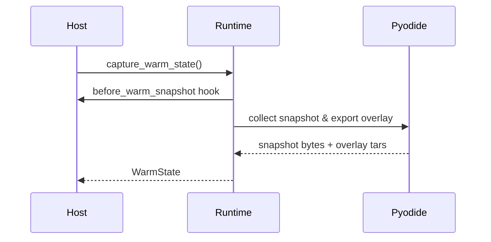
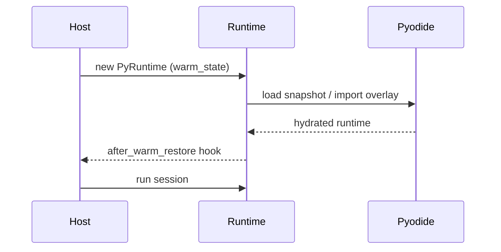

# Host Integration (Rust)

This guide shows how to embed `aardvark-core` in a Rust service. It covers runtime setup, bundle execution, pooling, and error handling. Everything here is **experimental** and likely to change; use it for prototypes rather than production traffic.

The same surface runs JavaScript bundles: set `InvocationDescriptor::runtime.language` or add `"runtime": {"language": "javascript"}` to the manifest. JavaScript bundles must ship their own modules; the runtime never resolves npm packages.

## Adding the dependency

```toml
[dependencies]
aardvark-core = { path = "crates/aardvark-core" }
```

For crates.io you will depend on the published version instead of the workspace path.

## Preparing [Pyodide](https://pyodide.org/) assets

Before initialising a Python runtime, stage the pinned Aardvark Pyodide
distribution on disk. The distribution contains the upstream Pyodide 0.29.4
runtime files, package files, Aardvark adapter scripts, a manifest, and a
compatibility fingerprint.

Use the CLI helper:

```bash
cargo run -p aardvark-cli -- assets stage --variant full
cargo run -p aardvark-cli -- assets verify \
  .aardvark/pyodide-distributions/aardvark-0.1.1-pyodide-v0.29.4-full
```

Then either set `AARDVARK_PYODIDE_DIST_DIR` or configure the runtime directly:

```rust
let config = PyRuntimeConfig::default()
    .with_pyodide_dist_dir(".aardvark/pyodide-distributions/aardvark-0.1.1-pyodide-v0.29.4-full");
```

The `core` variant is useful for runtimes that do not need the full wheel set.
Package loading is resolved exclusively through the verified distribution; flat
wheel-cache directories are not a supported runtime contract.

## Persistent isolates (`PythonIsolate`)

```rust
use aardvark_core::{
    persistent::{BundleArtifact, BundleHandle, HandlerSession, PythonIsolate},
    IsolateConfig,
};

fn build_isolate(bytes: &[u8]) -> anyhow::Result<(PythonIsolate, HandlerSession)> {
    let artifact = BundleArtifact::from_bytes(bytes)?;
    let handle = BundleHandle::from_artifact(artifact.clone());

    let mut isolate = PythonIsolate::new(IsolateConfig::default())?;
    isolate.load_bundle(&handle)?; // optional warm-up

    let handler = handle.prepare_default_handler();
    Ok((isolate, handler))
}

fn invoke(handler: &HandlerSession, isolate: &mut PythonIsolate) -> anyhow::Result<()> {
    let outcome = handler.invoke(isolate)?;
    if outcome.is_success() {
        tracing::info!(stdout = %outcome.diagnostics.stdout);
    } else {
        tracing::warn!(?outcome.status, "handler failed");
    }
    Ok(())
}
```

Key knobs via `IsolateConfig` / `PyRuntimeConfig`:

- `snapshot.load_from` / `snapshot.save_to` – warm snapshot management.
- `cleanup` – choose between full cleanup, shared-buffer-only scrubbing, or no automatic cleanup.
- `budget_override` – clamp descriptor limits globally.
- `host_capabilities` – capability allowlist applied to every call unless a manifest narrows it further.
- `pyodide_dist_dir` – override the staged Aardvark Pyodide distribution path
  without relying on process-wide environment variables.

### Inline Python without a bundle

```rust
use aardvark_core::{
    BundleArtifact, BundleHandle, InlinePythonOptions, IsolateConfig, ManifestCpuResources,
    ManifestResources, PythonIsolate,
};

let mut isolate = PythonIsolate::new(IsolateConfig::default())?;
let mut options = InlinePythonOptions::default();
options.entrypoint = Some("main:handler".into());
options.packages = vec!["numpy".into()];
options.resources = Some(ManifestResources {
    cpu: Some(ManifestCpuResources { default_limit_ms: Some(3_000) }),
    ..Default::default()
});

let script = r#"
import numpy as np

def handler(user: str = "world"):
    return f"hi {user}, numpy={np.__name__}"
"#;

let outcome = isolate.run_inline_python_with_options(script, options)?;
assert_eq!(outcome.payload().unwrap().kind(), "text");
```

`InlinePythonOptions` produces a manifest next to the inline module so you can request packages, tweak resource policies, or target a specific Pyodide build. `PythonIsolate::run_inline_python` remains as a shorthand for the default `main:handler` entrypoint without any extra manifest hints.

If you want to reuse the inline handler across isolates or pools, build a `BundleArtifact` directly:

```rust
let artifact = BundleArtifact::from_inline_python(script, InlinePythonOptions::default())?;
let handle = BundleHandle::from_artifact(artifact.clone());
let handler = handle.prepare_default_handler();
let mut isolate = PythonIsolate::new(IsolateConfig::default())?;
isolate.load_bundle(&handle)?;
let outcome = handler.invoke(&mut isolate)?;
```

This path keeps a normalised manifest and fingerprint so pooling, caching, and descriptor overrides work exactly the same way as ZIP-backed bundles.

## Pooling (`BundlePool`)

```rust
use std::sync::Arc;

use aardvark_core::persistent::{
    BundleArtifact, BundlePool, LifecycleHooks, PoolOptions, QueueMode,
};

fn pooled_calls(bytes: &[u8]) -> anyhow::Result<()> {
    let artifact = BundleArtifact::from_bytes(bytes)?;
    let pool = BundlePool::from_artifact(
        artifact.clone(),
        PoolOptions {
            desired_size: 2,
            max_size: 4,
            max_queue: Some(32),
            queue_mode: QueueMode::Block,
            heap_limit_kib: Some(256 * 1024),
            memory_limit_kib: Some(512 * 1024),
            lifecycle_hooks: Some(LifecycleHooks {
                on_isolate_started: Some(Arc::new(|id, _cfg| tracing::debug!(isolate_id = id, "started"))),
                on_isolate_recycled: Some(Arc::new(|id, reason| {
                    tracing::debug!(isolate_id = id, ?reason, "recycled")
                })),
                ..Default::default()
            }),
            ..PoolOptions::default()
        },
    )?;

    let handle = pool.handle();
    let handler = handle.prepare_default_handler();

    for _ in 0..4 {
        let outcome = pool.call_default(&handler)?;
        tracing::info!(
            queue_wait_ms = outcome.diagnostics.queue_wait_ms,
            heap_kib = outcome.diagnostics.py_heap_kib,
        );
    }

    let stats = pool.stats();
    tracing::info!(
        invocations = stats.invocations,
        avg_ms = stats.average_queue_wait_ms,
        p95_ms = stats.queue_wait_p95_ms,
        quarantine_events = stats.quarantine_events,
        scaledown_events = stats.scaledown_events,
    );
    Ok(())
}
```

Key `PoolOptions` knobs:

- **Concurrency** – `desired_size` (initial isolates) and `max_size` (upper bound). Calls queue when all isolates are busy; hosts can adjust concurrency at runtime via `BundlePool::set_desired_size` or `BundlePool::resize`.
- **Queueing behaviour** – `queue_mode::Block` waits until an isolate is free; `queue_mode::FailFast` surfaces `PoolQueueFull` immediately. `max_queue` caps queued calls.
- **Resource guard rails** – `heap_limit_kib` and `memory_limit_kib` quarantine isolates that exceed the configured budgets.
- **Lifecycle hooks** – `LifecycleHooks` expose `on_isolate_started`, `on_isolate_recycled`, `on_call_started`, and `on_call_finished` so hosts can attach custom monitoring.
  `on_isolate_recycled` receives a `RecycleReason` so you can distinguish between normal reuse, guard-rail quarantines, scale downs, and shutdowns.
- **Telemetry flushing** – `telemetry_interval` controls the background reporter that logs queue depth/percentiles to `tracing` (`aardvark::telemetry`). Set it to `None` to disable periodic emission if you prefer to poll stats manually.

`PoolStats` now reports invocation counts, average queue wait, queue wait percentiles, and guard-rail counters (total quarantines, heap-triggered quarantines, RSS-triggered quarantines, and scale-down events). `ExecutionOutcome` diagnostics capture per-call queue wait, heap usage, and (on Linux and macOS) RSS snapshots so hosts can alert when an invocation runs close to the limits.

```rust
let pool_telemetry = PoolTelemetry::from(&pool.stats());
metrics::gauge!("aardvark.pool.isolates.total", pool_telemetry.total_isolates as f64);
if let Some(p95) = pool_telemetry.queue_wait_p95_ms {
    metrics::histogram!("aardvark.pool.queue_wait_p95_ms", p95);
}
metrics::counter!("aardvark.pool.quarantine.total", pool_telemetry.quarantine_events as u64);
```

### Moving away from `PyRuntimePool`

`PyRuntimePool` is still available but `BundlePool` provides stricter cleanup,
better telemetry, and host-controlled guard rails. To adopt it:

1. Replace the old `PoolConfig` construction with `PoolOptions`. Copy over the
   concurrency knobs (`max_runtimes` → `desired_size/max_size`) and reset mode
   (`PoolResetMode::InPlace` corresponds to `CleanupMode::Full`).
2. Parse your bundle into a `BundleArtifact` once, then initialise a
   `BundlePool::from_artifact` with optional limits (`heap_limit_kib`,
   `memory_limit_kib`) and hooks.
3. Swap `handle.runtime()` usage for `BundleHandle::prepare_handler` and
   `pool.call_json`/`pool.call_rawctx`. Diagnostics now surface `queue_wait_ms`,
   `prepare_ms`, `cleanup_ms`, heap usage, and (Linux/macOS) RSS snapshots per
   call.
4. If you previously logged pool stats manually, consider either reading
   `PoolTelemetry::from(&pool.stats())` or enabling the background reporter via
   `telemetry_interval` to stream queue metrics into your tracing backend.

Once hosts adopt `BundlePool`, `PyRuntimePool` can be reserved for legacy
scenarios (custom reset flows, non-Python engines) without blocking access to
the newer guard rails.

## Dropping down to `PyRuntime`

`PythonIsolate` and `BundlePool` wrap the original `PyRuntime`. Reach for it when you need low-level hooks (custom descriptor construction, manual resets, direct access to the JS runtime):

```rust
use aardvark_core::{Bundle, InvocationDescriptor, PyRuntime, PyRuntimeConfig};

fn manual(bytes: &[u8]) -> anyhow::Result<()> {
    let mut runtime = PyRuntime::new(PyRuntimeConfig::default())?;
    let bundle = Bundle::from_zip_bytes(bytes)?;
    let descriptor = InvocationDescriptor::new("main:handler".into());
    let session = runtime.prepare_session_with_descriptor(bundle, descriptor)?;
    let outcome = runtime.run_session(&session)?;
    tracing::info!(?outcome.status);
    Ok(())
}
```

`PyRuntimeConfig` still exposes `snapshot.*`, `budget_override`, `host_capabilities`, and warm snapshot hooks (`before_warm_snapshot`, `after_warm_restore`).

## Resetting a runtime explicitly

- `reset_to_snapshot()` recreates the language engine from scratch. This is the slow but safest option when you want to reclaim every resource.
- `reset_in_place()` reuses the existing isolate, wipes the context, and replays the bootstrap assets before the next invocation.
- `WarmState::into_overlay_preloaded()` indicates that overlay contents were baked into the snapshot so restores can skip the expensive import.
- Every reset records `mode`, `duration_ms`, and `engine_generation` so the next invocation’s diagnostics explain how the runtime was scrubbed.

## Warm Snapshots for Faster Cold Starts

If you want Cloudflare-style deploy-time hydration, capture a warm snapshot once and reuse it:

```rust
use aardvark_core::{Bundle, PyRuntime, PyRuntimeConfig, WarmState};

fn bake_warm_state(bytes: &[u8]) -> anyhow::Result<(WarmState, Bundle)> {
    let mut runtime = PyRuntime::new(PyRuntimeConfig::default())?;
    let bundle = Bundle::from_zip_bytes(bytes)?;
    runtime.prepare_session_with_manifest(bundle.clone())?;
    // Optional: execute warm-up imports or other setup work here.
    let warm = runtime.capture_warm_state()?;
    Ok((warm, bundle))
}

fn host_with_warm_state(warm: WarmState) -> anyhow::Result<PyRuntime> {
    let mut config = PyRuntimeConfig::default();
    config.warm_state = Some(warm);
    PyRuntime::new(config)
}
```

The saved `WarmState` bundles a Pyodide memory snapshot with its overlay and the active distribution compatibility fingerprint. Runtimes constructed with it skip package installation and reject the state if the fingerprint does not match the configured distribution. Call `config.snapshot.clear_cache()` or set `config.warm_state = None` if you regenerate the warm state at runtime.

Warm states captured via `capture_warm_state()` include overlay metadata and normally import that overlay during restore. If you persist or index warm states outside the runtime, keep `WarmState::compatibility_fingerprint()` with the snapshot record; hosts can compare it with `PyRuntime::pyodide_compatibility_fingerprint()` before reuse. If you assemble a warm state manually, construct it with the matching Pyodide distribution fingerprint and call `WarmState::with_overlay_preloaded` (or `WarmState::into_overlay_preloaded`) only after hydrating the overlay into the snapshot image.

### Warm Snapshot Hooks

Hooks let you run custom logic right before a snapshot is captured and immediately after a warm snapshot is applied:

```rust
use std::sync::Arc;
use aardvark_core::{Bundle, PyRuntime, PyRuntimeConfig};

let mut config = PyRuntimeConfig::default();
config.hooks.before_warm_snapshot = Some(Arc::new(|runtime| {
    // e.g. run a throwaway session to precompile heavy modules
    let preload = Bundle::from_zip_bytes(include_bytes!("../../prewarm.zip"))?;
    runtime.prepare_session_with_manifest(preload)?;
    Ok(())
}));

config.hooks.after_warm_restore = Some(Arc::new(|runtime| {
    tracing::info!(runtime = runtime.runtime_id().unwrap_or("<anonymous>"), "warm snapshot ready");
    Ok(())
}));
```

Hooks execute synchronously on the calling thread; keep them fast and deterministic.

#### Flow Diagrams





> **Warm Snapshot Limitations**
> - Warm states are distribution-specific. Changing Pyodide builds, adapter versions, or required packages requires capturing a new snapshot; the runtime rejects missing or mismatched distribution fingerprints.
> - Hooks and restoration run synchronously; long-running work will block the thread performing the reset.

## Custom strategies

```rust
use aardvark_core::{DefaultInvocationStrategy, PyInvocationStrategy};

let mut strategy = DefaultInvocationStrategy::default();
let outcome = runtime.run_session_with_strategy(&session, &mut strategy)?;
```

Implement `PyInvocationStrategy` when you need bespoke argument decoding or multi-phase execution. Strategies receive an `InvocationContext` with access to the JS runtime for advanced orchestration.

## Error handling

- `PyRunnerError` covers infrastructure failures (bad bundles, JS init issues). Treat them as deployment problems.
- `ExecutionOutcome::failure` indicates the handler ran (or was attempted) but finished unsuccessfully; inspect `FailureKind` for the root cause.
- Always read `diagnostics.stderr` even on success; Python warnings are printed there.

## Diagnostics export

```rust
use aardvark_core::SandboxTelemetry;

fn record(outcome: &ExecutionOutcome) {
    let telemetry: SandboxTelemetry = outcome.sandbox_telemetry();
    metrics::histogram!("aardvark.cpu_ms", telemetry.cpu_ms_used.unwrap_or(0) as f64);
    if telemetry.has_policy_violations() {
        tracing::warn!(?telemetry, "policy violation");
    }
}
```

`SandboxTelemetry` implements `Clone` so you can send it to background workers without keeping the original outcome alive. It mirrors `Diagnostics::reset`, exposing the reset mode, duration, and engine generation so you can correlate pool behaviour with host metrics. Shared buffers arrive as zero-copy handles; prefer `SharedBufferHandle::as_slice()` to keep them zero-copy unless you truly need an owned copy.

## Quick benchmark harness

To compare host-side timings with the core runtime, run the example bench:

```
cargo run -p aardvark-core --example bench_echo -- 100 1024
```

Arguments are `[iterations] [payload_len]`. The harness warms the runtime, captures a warm snapshot, and prints avg/min/max for `prepare`, `run`, and `total` so you can verify pooling behaviour in isolation.

## Known gaps

- There is no async API; integrate with async runtimes by wrapping the blocking calls in thread pools.
- Shared buffers expose zero-copy views via `SharedBufferHandle::as_slice()`; call `into_bytes()` only if you need an owned copy.
- JavaScript bundles are “bring your own modules”: package resolution is not performed at runtime, so ship a single self-contained bundle produced by your JS bundler.
- Manifest-driven package distributions must be staged out of band. The core crate does not download wheels from the network.

## Stability & Release Readiness

- Neither runtime path is production hardened. Expect breaking changes to manifests, descriptors, and configuration while we iterate.
- The manifest schema is currently versioned as `1.0` but should be treated as provisional; schema bumps may happen without backwards compatibility.
