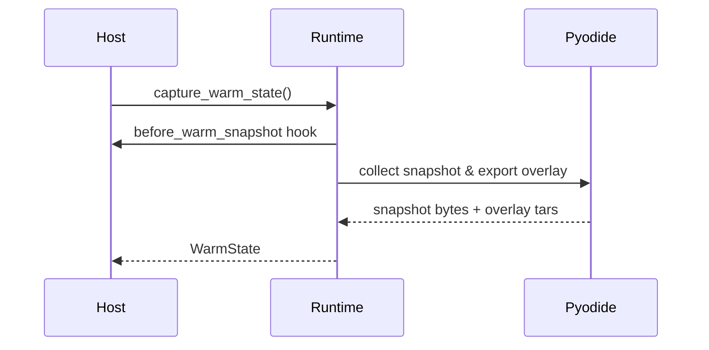
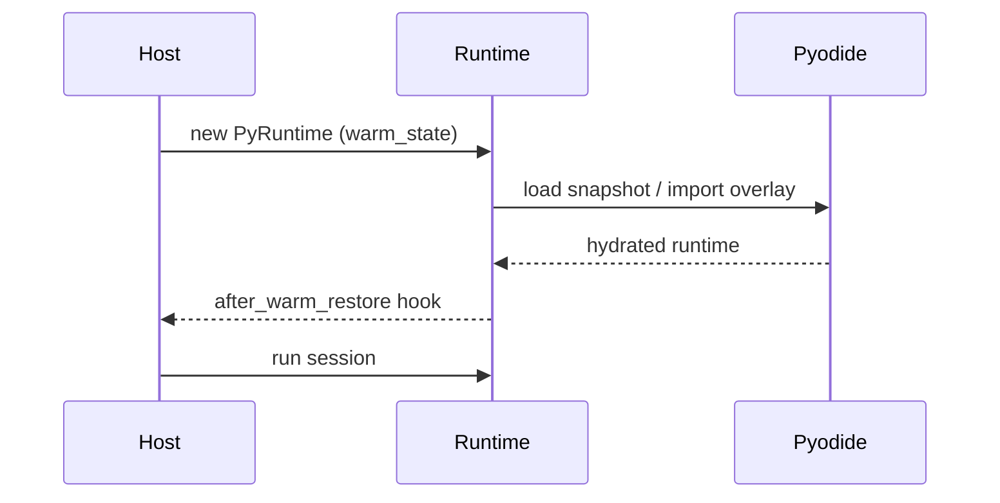

# Host Integration (Rust)

This guide shows how to embed `aardvark-core` in a Rust service. It covers runtime setup, bundle execution, pooling, and error handling. Everything here is **experimental** and likely to change; use it for prototypes rather than production traffic.

## Adding the dependency

```toml
[dependencies]
aardvark-core = { path = "crates/aardvark-core" }
```

For crates.io you will depend on the published version instead of the workspace path.

## Preparing Pyodide assets

Before initialising the runtime you need the pinned Pyodide bundle on disk.
Download the upstream archive, extract it, and move the desired variant into a
flat directory so the runtime can resolve requests such as
`pyodide/v0.28.2/full/numpy-….whl` from
`./.aardvark/pyodide/0.28.2/numpy-….whl`:

```
mkdir -p .aardvark/pyodide/0.28.2
curl -L -o pyodide-0.28.2.tar.bz2 \
  https://github.com/pyodide/pyodide/releases/download/0.28.2/pyodide-0.28.2.tar.bz2
echo "31021174e8fdc9556c17e9d435e20d9c07f203ac542d9161ca3b8d9d5d04e7e7  pyodide-0.28.2.tar.bz2" | sha256sum --check
tar -xjf pyodide-0.28.2.tar.bz2
rsync -a pyodide/pyodide/v0.28.2/full/ .aardvark/pyodide/0.28.2/
rm -rf pyodide pyodide-0.28.2.tar.bz2
```

Export `AARDVARK_PYODIDE_PACKAGE_DIR=.aardvark/pyodide/0.28.2` (or configure
`PyRuntimeConfig`) before preparing a session. Swap the archive for the core
bundle if you do not need the full wheel set, and update the URL/hash whenever
you bump the pinned version.

## Persistent isolates (`PythonIsolate`)

```rust
use aardvark_core::{
    persistent::{BundleArtifact, BundleHandle, HandlerSession, PythonIsolate},
    IsolateConfig,
};

fn build_isolate(bytes: &[u8]) -> anyhow::Result<(PythonIsolate, HandlerSession)> {
    let artifact = BundleArtifact::from_bytes(bytes)?;
    let handle = BundleHandle::from_artifact(artifact.clone());

    let mut isolate = PythonIsolate::new(IsolateConfig::default())?;
    isolate.load_bundle(&handle)?; // optional warm-up

    let handler = handle.prepare_default_handler();
    Ok((isolate, handler))
}

fn invoke(handler: &HandlerSession, isolate: &mut PythonIsolate) -> anyhow::Result<()> {
    let outcome = handler.invoke(isolate)?;
    if outcome.is_success() {
        tracing::info!(stdout = %outcome.diagnostics.stdout);
    } else {
        tracing::warn!(?outcome.status, "handler failed");
    }
    Ok(())
}
```

Key knobs via `IsolateConfig` / `PyRuntimeConfig`:

- `snapshot.load_from` / `snapshot.save_to` – warm snapshot management.
- `cleanup` – choose between full cleanup, shared-buffer-only scrubbing, or no automatic cleanup.
- `budget_override` – clamp descriptor limits globally.
- `host_capabilities` – capability allowlist applied to every call unless a manifest narrows it further.

### Inline Python without a bundle

```rust
let mut isolate = PythonIsolate::new(IsolateConfig::default())?;
let script = r#"
def handler(user: str = "world"):
    return f"hi {user}"
"#;
let outcome = isolate.run_inline_python(script, "main:handler")?;
assert_eq!(outcome.payload().unwrap().kind(), "text");
```

The helper wraps the snippet into an ephemeral bundle (stored entirely in memory) so you can run smoke tests or templated code without touching the bundler.

## Serial pooling (`BundlePool`)

```rust
use aardvark_core::persistent::{BundleArtifact, BundlePool, PoolOptions};

fn pooled_calls(bytes: &[u8]) -> anyhow::Result<()> {
    let artifact = BundleArtifact::from_bytes(bytes)?;
    let pool = BundlePool::from_artifact(artifact.clone(), PoolOptions::default())?;
    let handle = pool.handle();
    let handler = handle.prepare_default_handler();

    for _ in 0..4 {
        let outcome = pool.call_default(&handler)?;
        tracing::info!(queue_wait_ms = ?outcome.diagnostics.queue_wait_ms);
    }
    Ok(())
}
```

The pool currently serialises invocations through one isolate while tracking queue-wait telemetry and aggregate counts (`PoolStats::invocations`, `average_queue_wait_ms`). Future revisions will expose configurable concurrency; avoid relying on the single-isolate behaviour.

## Dropping down to `PyRuntime`

`PythonIsolate` and `BundlePool` wrap the original `PyRuntime`. Reach for it when you need low-level hooks (custom descriptor construction, manual resets, direct access to the JS runtime):

```rust
use aardvark_core::{Bundle, InvocationDescriptor, PyRuntime, PyRuntimeConfig};

fn manual(bytes: &[u8]) -> anyhow::Result<()> {
    let mut runtime = PyRuntime::new(PyRuntimeConfig::default())?;
    let bundle = Bundle::from_zip_bytes(bytes)?;
    let descriptor = InvocationDescriptor::new("main:handler".into());
    let session = runtime.prepare_session_with_descriptor(bundle, descriptor)?;
    let outcome = runtime.run_session(&session)?;
    tracing::info!(?outcome.status);
    Ok(())
}
```

`PyRuntimeConfig` still exposes `snapshot.*`, `budget_override`, `host_capabilities`, and warm snapshot hooks (`before_warm_snapshot`, `after_warm_restore`).

## Resetting a runtime explicitly

- `reset_to_snapshot()` recreates the language engine from scratch. This is the slow but safest option when you want to reclaim every resource.
- `reset_in_place()` reuses the existing isolate, wipes the context, and replays the bootstrap assets before the next invocation.
- `WarmState::into_overlay_preloaded()` indicates that overlay contents were baked into the snapshot so in-place resets can skip the expensive import.
- Every reset records `mode`, `duration_ms`, and `engine_generation` so the next invocation’s diagnostics explain how the runtime was scrubbed.

## Warm Snapshots for Faster Cold Starts

If you want Cloudflare-style deploy-time hydration, capture a warm snapshot once and reuse it:

```rust
use aardvark_core::{Bundle, PyRuntime, PyRuntimeConfig, WarmState};

fn bake_warm_state(bytes: &[u8]) -> anyhow::Result<(WarmState, Bundle)> {
    let mut runtime = PyRuntime::new(PyRuntimeConfig::default())?;
    let bundle = Bundle::from_zip_bytes(bytes)?;
    runtime.prepare_session_with_manifest(bundle.clone())?;
    // Optional: execute warm-up imports or other setup work here.
    let warm = runtime.capture_warm_state()?;
    Ok((warm, bundle))
}

fn host_with_warm_state(warm: WarmState) -> anyhow::Result<PyRuntime> {
    let mut config = PyRuntimeConfig::default();
    config.warm_state = Some(warm);
    PyRuntime::new(config)
}
```

The saved `WarmState` bundles a Pyodide memory snapshot with its overlay. Runtimes constructed with it skip package installation and restore the filesystem/DLLs immediately. Call `config.snapshot.clear_cache()` or set `config.warm_state = None` if you regenerate the warm state at runtime.

Warm states captured via `capture_warm_state()` mark the overlay as preloaded, so `reset_in_place()` skips the heavy overlay import. If you assemble a warm state manually, call `WarmState::with_overlay_preloaded` (or `WarmState::into_overlay_preloaded`) after hydrating the overlay to unlock the same fast path.

### Warm Snapshot Hooks

Hooks let you run custom logic right before a snapshot is captured and immediately after a warm snapshot is applied:

```rust
use std::sync::Arc;
use aardvark_core::{Bundle, PyRuntime, PyRuntimeConfig};

let mut config = PyRuntimeConfig::default();
config.hooks.before_warm_snapshot = Some(Arc::new(|runtime| {
    // e.g. run a throwaway session to precompile heavy modules
    let preload = Bundle::from_zip_bytes(include_bytes!("../../prewarm.zip"))?;
    runtime.prepare_session_with_manifest(preload)?;
    Ok(())
}));

config.hooks.after_warm_restore = Some(Arc::new(|runtime| {
    tracing::info!(runtime = runtime.runtime_id().unwrap_or("<anonymous>"), "warm snapshot ready");
    Ok(())
}));
```

Hooks execute synchronously on the calling thread; keep them fast and deterministic.

#### Flow Diagrams





> **Warm Snapshot Limitations**
> - Warm states are version- and manifest-specific. Changing Pyodide builds or required packages requires capturing a new snapshot; the runtime does not validate mismatches for you.
> - Hooks and restoration run synchronously; long-running work will block the thread performing the reset.

## Custom strategies

```rust
use aardvark_core::{DefaultInvocationStrategy, PyInvocationStrategy};

let mut strategy = DefaultInvocationStrategy::default();
let outcome = runtime.run_session_with_strategy(&session, &mut strategy)?;
```

Implement `PyInvocationStrategy` when you need bespoke argument decoding or multi-phase execution. Strategies receive an `InvocationContext` with access to the JS runtime for advanced orchestration.

## Error handling

- `PyRunnerError` covers infrastructure failures (bad bundles, JS init issues). Treat them as deployment problems.
- `ExecutionOutcome::failure` indicates the handler ran (or was attempted) but finished unsuccessfully; inspect `FailureKind` for the root cause.
- Always read `diagnostics.stderr` even on success; Python warnings are printed there.

## Diagnostics export

```rust
use aardvark_core::SandboxTelemetry;

fn record(outcome: &ExecutionOutcome) {
    let telemetry: SandboxTelemetry = outcome.sandbox_telemetry();
    metrics::histogram!("aardvark.cpu_ms", telemetry.cpu_ms_used.unwrap_or(0) as f64);
    if telemetry.has_policy_violations() {
        tracing::warn!(?telemetry, "policy violation");
    }
}
```

`SandboxTelemetry` implements `Clone` so you can send it to background workers without keeping the original outcome alive. It mirrors `Diagnostics::reset`, exposing the reset mode, duration, and engine generation so you can correlate pool behaviour with host metrics. Shared buffers arrive as zero-copy handles; prefer `SharedBufferHandle::as_slice()` to keep them zero-copy unless you truly need an owned copy.

## Quick benchmark harness

To compare host-side timings with the core runtime, run the example bench:

```
cargo run -p aardvark-core --example bench_echo -- 100 1024
```

Arguments are `[iterations] [payload_len]`. The harness warms the runtime, captures a warm snapshot, and prints avg/min/max for `prepare`, `run`, and `total` so you can verify pooling behaviour in isolation.

## Known gaps

- There is no async API; integrate with async runtimes by wrapping the blocking calls in thread pools.
- Shared buffers expose zero-copy views via `SharedBufferHandle::as_slice()`; call `into_bytes()` only if you need an owned copy.
- JavaScript bundles are “bring your own modules”: package resolution is not performed at runtime, so ship a single self-contained bundle produced by your JS bundler.
- Manifest-driven package caches must be prepared out of band. The core crate does not download wheels from the network.

## Stability & Release Readiness

- Neither runtime path is production hardened. Expect breaking changes to manifests, descriptors, and configuration while we iterate.
- The manifest schema is currently versioned as `1.0` but should be treated as provisional; schema bumps may happen without backwards compatibility.
- When we approach a stable release we will publish migration guides and follow semantic versioning.
