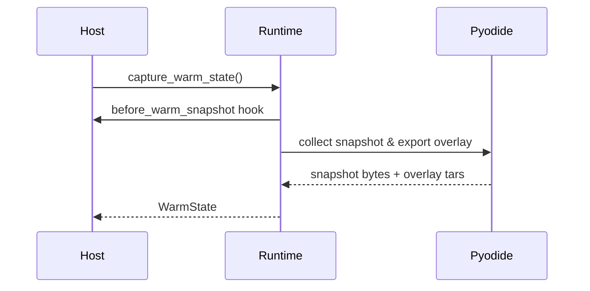
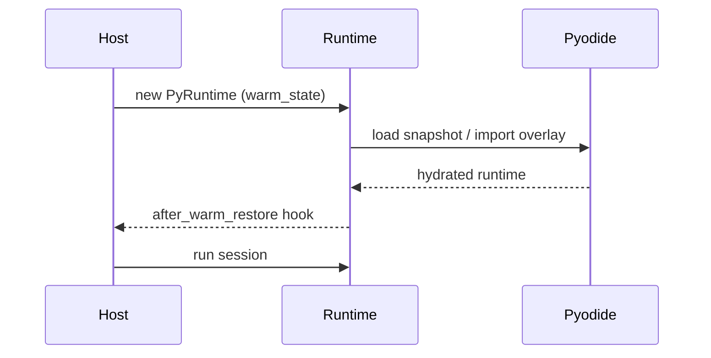

# Host Integration (Rust)

This guide shows how to embed `aardvark-core` in a Rust service. It covers runtime setup, bundle execution, pooling, and error handling. Everything here is **experimental** and likely to change; use it for prototypes rather than production traffic.

## Adding the dependency

```toml
[dependencies]
aardvark-core = { path = "crates/aardvark-core" }
```

For crates.io you will depend on the published version instead of the workspace path.

## Preparing Pyodide assets

Before initialising the runtime you need the pinned Pyodide bundle on disk.
Download the upstream archive, extract it, and move the desired variant into a
flat directory so the runtime can resolve requests such as
`pyodide/v0.28.2/full/numpy-….whl` from
`./.aardvark/pyodide/0.28.2/numpy-….whl`:

```
mkdir -p .aardvark/pyodide/0.28.2
curl -L -o pyodide-0.28.2.tar.bz2 \
  https://github.com/pyodide/pyodide/releases/download/0.28.2/pyodide-0.28.2.tar.bz2
echo "31021174e8fdc9556c17e9d435e20d9c07f203ac542d9161ca3b8d9d5d04e7e7  pyodide-0.28.2.tar.bz2" | sha256sum --check
tar -xjf pyodide-0.28.2.tar.bz2
rsync -a pyodide/pyodide/v0.28.2/full/ .aardvark/pyodide/0.28.2/
rm -rf pyodide pyodide-0.28.2.tar.bz2
```

Export `AARDVARK_PYODIDE_PACKAGE_DIR=.aardvark/pyodide/0.28.2` (or configure
`PyRuntimeConfig`) before preparing a session. Swap the archive for the core
bundle if you do not need the full wheel set, and update the URL/hash whenever
you bump the pinned version.

## Creating a runtime

```rust
use aardvark_core::{PyRuntime, PyRuntimeConfig};

fn build_runtime() -> anyhow::Result<PyRuntime> {
    let mut config = PyRuntimeConfig::default();
    config.reset_policy = aardvark_core::config::ResetPolicy::AfterInvocation;
    config.snapshot.load_from = Some("/srv/snapshots/pandas.bin".into());
    let runtime = PyRuntime::new(config)?;
    Ok(runtime)
}
```

Key configuration knobs:

- `snapshot.load_from` – optional warm snapshot path.
- `snapshot.save_to` – capture a new snapshot after the first load.
- Snapshots are cached in memory after the first read; call `config.snapshot.clear_cache()` if you regenerate the file at runtime.
- `budget_override` – clamp descriptor limits globally (e.g., enforce platform-wide CPU ceilings).
- `host_capabilities` – capability allowlist applied to every session unless the manifest narrows it further.
- `default_language` – fallback guest language when descriptors/manifests omit one (defaults to `python`; set to `javascript` to prefer the preview engine).

## Preparing a session

```rust
use aardvark_core::{Bundle, PyRuntime};

fn load_bundle(bytes: &[u8]) -> anyhow::Result<Bundle> {
    // Parse once and keep the value around — cloning `Bundle` is cheap.
    Bundle::from_zip_bytes(bytes)
}

fn prepare(runtime: &mut PyRuntime, bundle: Bundle) -> anyhow::Result<aardvark_core::PySession> {
    let (session, manifest_opt) = runtime.prepare_session_with_manifest(bundle)?;
    if let Some(manifest) = manifest_opt {
        tracing::info!(packages = ?manifest.packages(), "manifest applied");
    }
    Ok(session)
}
```

If you need full control, create an `InvocationDescriptor` and call `prepare_session_with_descriptor` instead. The descriptor lets you pin the language per invocation via `descriptor.language = Some(RuntimeLanguage::JavaScript);`.

## Running the session

```rust
use aardvark_core::{ExecutionOutcome, FailureKind};

fn invoke(runtime: &mut PyRuntime, session: &aardvark_core::PySession) -> anyhow::Result<()> {
    let outcome = runtime.run_session(session)?;
    if outcome.is_success() {
        let payload = outcome.payload();
        println!("handler returned {:?}", payload);
    } else if let FailureKind::PythonException(exc) = &outcome.status {
        eprintln!("python raised: {:?}\nstdout:{}\nstderr:{}",
            exc, outcome.diagnostics.stdout, outcome.diagnostics.stderr);
    }

    let telemetry = outcome.sandbox_telemetry();
    tracing::info!(cpu_ms = ?telemetry.cpu_ms_used, "cpu usage");
    Ok(())
}
```

All payload types are supported: text, JSON, binary, and shared buffers. Use pattern matching to unwrap the one you expect.

## Using the runtime pool

```rust
use aardvark_core::{PoolConfig, PoolResetMode, PyRuntimePool, PyRuntimeConfig};

fn pool_example() -> anyhow::Result<()> {
    let mut config = PoolConfig::new(8, PyRuntimeConfig::default());
    config.reset_mode = PoolResetMode::InPlace; // reuse isolates between checkouts
    let pool = PyRuntimePool::new(config)?;
    let mut handle = pool.checkout()?;
    let bundle = Bundle::from_zip_bytes(include_bytes!("../../hello_bundle.zip"))?;
    let session = handle.runtime().prepare_session_with_manifest(bundle)?.0;
    let outcome = handle.runtime().run_session(&session)?;
    drop(handle); // returns runtime to the pool; reset happens lazily in the background queue
    assert!(outcome.is_success());
    Ok(())
}
```

Pool handles implement `Drop`; always let them go out of scope to return the runtime. If reset fails, the runtime is discarded and capacity decreases until a new runtime is created.

Returned runtimes are marked dirty and scrubbed the next time the pool needs additional capacity. That keeps the hand-off path fast while still ensuring every checkout observes a clean snapshot.

> **Pool Limitation:** resets still run on the thread that performs the next checkout. If the warm snapshot takes ~800 ms to hydrate, the first borrower after a drop still pays that cost.

## Resetting a runtime explicitly

- `reset_to_snapshot()` recreates the language engine from scratch. This is the slow but safest option when you want to reclaim every resource.
- `reset_in_place()` reuses the existing isolate, wipes the context, and replays the bootstrap assets so the next invocation starts from the warm snapshot without a full teardown.
- `PoolResetMode::InPlace` lets the pool call `reset_in_place()` automatically when a handle is dropped; use it together with `ResetPolicy::Manual`.
- After a reset runs, the next invocation’s diagnostics include `reset.mode`, `reset.duration_ms`, and `reset.engine_generation` so hosts can export per-checkout latency metrics.

## Warm Snapshots for Faster Cold Starts

If you want Cloudflare-style deploy-time hydration, capture a warm snapshot once and reuse it:

```rust
use aardvark_core::{Bundle, PyRuntime, PyRuntimeConfig, WarmState};

fn bake_warm_state(bytes: &[u8]) -> anyhow::Result<(WarmState, Bundle)> {
    let mut runtime = PyRuntime::new(PyRuntimeConfig::default())?;
    let bundle = Bundle::from_zip_bytes(bytes)?;
    runtime.prepare_session_with_manifest(bundle.clone())?;
    // Optional: execute warm-up imports or other setup work here.
    let warm = runtime.capture_warm_state()?;
    Ok((warm, bundle))
}

fn host_with_warm_state(warm: WarmState) -> anyhow::Result<PyRuntime> {
    let mut config = PyRuntimeConfig::default();
    config.warm_state = Some(warm);
    PyRuntime::new(config)
}
```

The saved `WarmState` bundles a Pyodide memory snapshot with its overlay. Runtimes constructed with it skip package installation and restore the filesystem/DLLs immediately. Call `config.snapshot.clear_cache()` or set `config.warm_state = None` if you regenerate the warm state at runtime.

Warm states captured via `capture_warm_state()` mark the overlay as preloaded, so `reset_in_place()` skips the heavy overlay import. If you assemble a warm state manually, call `WarmState::with_overlay_preloaded` (or `WarmState::into_overlay_preloaded`) after hydrating the overlay to unlock the same fast path.

### Warm Snapshot Hooks

Hooks let you run custom logic right before a snapshot is captured and immediately after a warm snapshot is applied:

```rust
use std::sync::Arc;
use aardvark_core::{Bundle, PyRuntime, PyRuntimeConfig};

let mut config = PyRuntimeConfig::default();
config.hooks.before_warm_snapshot = Some(Arc::new(|runtime| {
    // e.g. run a throwaway session to precompile heavy modules
    let preload = Bundle::from_zip_bytes(include_bytes!("../../prewarm.zip"))?;
    runtime.prepare_session_with_manifest(preload)?;
    Ok(())
}));

config.hooks.after_warm_restore = Some(Arc::new(|runtime| {
    tracing::info!(runtime = runtime.runtime_id().unwrap_or("<anonymous>"), "warm snapshot ready");
    Ok(())
}));
```

Hooks execute synchronously on the calling thread; keep them fast and deterministic.

#### Flow Diagrams





> **Warm Snapshot Limitations**
> - Warm states are version- and manifest-specific. Changing Pyodide builds or required packages requires capturing a new snapshot; the runtime does not validate mismatches for you.
> - Hooks and restoration run synchronously; long-running work will block the thread performing the reset.

## Custom strategies

```rust
use aardvark_core::{DefaultInvocationStrategy, PyInvocationStrategy};

let mut strategy = DefaultInvocationStrategy::default();
let outcome = runtime.run_session_with_strategy(&session, &mut strategy)?;
```

Implement `PyInvocationStrategy` when you need bespoke argument decoding or multi-phase execution. Strategies receive an `InvocationContext` with access to the JS runtime for advanced orchestration.

## Error handling

- `PyRunnerError` covers infrastructure failures (bad bundles, JS init issues). Treat them as deployment problems.
- `ExecutionOutcome::failure` indicates the handler ran (or was attempted) but finished unsuccessfully; inspect `FailureKind` for the root cause.
- Always read `diagnostics.stderr` even on success; Python warnings are printed there.

## Diagnostics export

```rust
use aardvark_core::SandboxTelemetry;

fn record(outcome: &ExecutionOutcome) {
    let telemetry: SandboxTelemetry = outcome.sandbox_telemetry();
    metrics::histogram!("aardvark.cpu_ms", telemetry.cpu_ms_used.unwrap_or(0) as f64);
    if telemetry.has_policy_violations() {
        tracing::warn!(?telemetry, "policy violation");
    }
}
```

`SandboxTelemetry` implements `Clone` so you can send it to background workers without keeping the original outcome alive. It mirrors `Diagnostics::reset`, exposing the reset mode, duration, and engine generation so you can correlate pool behaviour with host metrics. Shared buffers arrive as zero-copy handles; prefer `SharedBufferHandle::as_slice()` to keep them zero-copy unless you truly need an owned copy.

## Quick benchmark harness

To compare host-side timings with the core runtime, run the example bench:

```
cargo run -p aardvark-core --example bench_echo -- 100 1024
```

Arguments are `[iterations] [payload_len]`. The harness warms the runtime, captures a warm snapshot, and prints avg/min/max for `prepare`, `run`, and `total` so you can verify pooling behaviour in isolation.

## Known gaps

- There is no async API; integrate with async runtimes by wrapping the blocking calls in thread pools.
- Shared buffers expose zero-copy views via `SharedBufferHandle::as_slice()`; call `into_bytes()` only if you need an owned copy.
- JavaScript bundles are “bring your own modules”: package resolution is not performed at runtime, so ship a single self-contained bundle produced by your JS bundler.
- Manifest-driven package caches must be prepared out of band. The core crate does not download wheels from the network.

## Stability & Release Readiness

- Neither runtime path is production hardened. Expect breaking changes to manifests, descriptors, and configuration while we iterate.
- The manifest schema is currently versioned as `1.0` but should be treated as provisional; schema bumps may happen without backwards compatibility.
- When we approach a stable release we will publish migration guides and follow semantic versioning.
