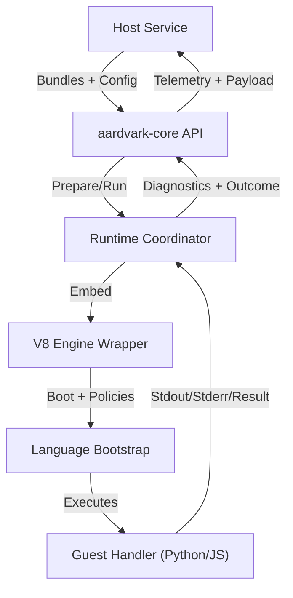
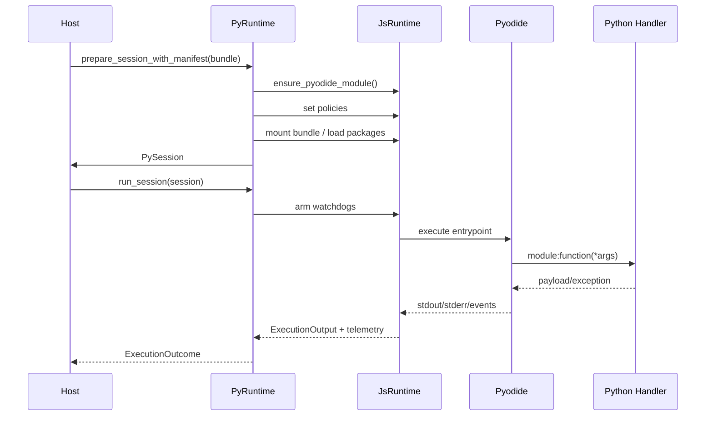

# Architecture Overview

This document describes Aardvark’s execution model from the host’s point of
view. It is for engineers embedding the runtime, checking the layering, or
deciding whether the current feature set fits a workload. For a shorter
overview, start with [`what-this-is.md`](what-this-is.md).

## System Goals

- Provide embeddable runtimes (Python via [Pyodide](https://pyodide.org/),
  JavaScript via [V8](https://v8.dev/)) without shipping a browser.
- Let hosts move dependency and package setup into manifests, overlays,
  snapshots, warmed pools, and warmed-host registries.
- Enforce resource limits inside the same process: CPU, wall time, heap, filesystem writes, and outbound network access.
- Keep the public Rust API narrow enough for direct hosts while leaving a clear
  boundary for host-owned shared-library adapters.
- Surface reset timings and sandbox telemetry so pooling strategies remain observable without tracing every call.

## Layers at a Glance

1. **Host integration (`aardvark-core`)** – public Rust API exposing persistent isolates (`PythonIsolate`), the pooled execution surface (`BundlePool`), and low-level access to `PyRuntime`.
2. **Runtime coordinator (`runtime.rs`)** – orchestrates session preparation, policy wiring, invocation strategies, and telemetry collection.
3. **Language engines (`runtime/python.rs`, `runtime/javascript.rs`)** – embed [V8](https://v8.dev/), load language-specific bootstraps, manage network/filesystem shims, and emit low-level traces.
4. **Guest bootstraps (`pyodide_bootstrap.js`, `js_runtime_bootstrap.js`)** – configure the interpreter, install packages (Python only), and enforce sandbox rules inside the WASM VM.
5. **User code** – Python bundles ([Pyodide](https://pyodide.org/)) or JavaScript modules executed under the same sandbox contract.

The layers are intentionally narrow: the host only talks to the coordinator, which in turn controls the JS engine. Python never reaches directly into host resources. A deeper walkthrough of each transition lives in [`lifecycle.md`](lifecycle.md).

## Execution Flow (Top to Bottom)

1. **Bundle ingestion** – Hosts create a `Bundle` (or `BundleArtifact`) from a ZIP archive. `bundle.rs` normalises paths and (optionally) extracts `aardvark.manifest.json`.
2. **Session negotiation** – `PythonIsolate` forwards to `PyRuntime::prepare_session_with_manifest`, which validates the manifest, derives descriptor limits, applies manifest resource policies, and loads any listed packages before mounting the bundle at `/app`.
3. **Strategy selection** – Unless overridden, `DefaultInvocationStrategy` serializes the descriptor and dispatches to the configured guest language. JavaScript reuses the same contract through `JavaScriptInvocationStrategy`.
4. **Watchdogs** – Wall-clock and CPU watchdogs arm before calling into the guest. Heap usage is checked both before and after execution.
5. **Sandbox enforcement** – The JS layer enforces network allowlists (HTTPS by default), filesystem mode/quota, and host capability gates for native bridges. Violations are raised back to Rust.
6. **Outcome synthesis** – Captured stdout/stderr, console messages, payloads, sandbox telemetry, and policy violations are combined into `ExecutionOutcome`.
7. **Reset** – Depending on `ResetPolicy`, runtimes either rebuild the engine (`reset_to_snapshot`) or scrub it in place (`reset_in_place`). Warm states captured inside the runtime carry overlay metadata and the active distribution fingerprint so restores can reject incompatible snapshots before rehydrating site-packages. `BundlePool` queues calls, fans them out across isolates, and hides resets behind the queue wait time.

The same flow is used whether the runtime comes from a pool or is standalone. Pooling only changes lifecycle management around steps 2 and 7.

## Design Notes

- **[Pyodide](https://pyodide.org/) inside [V8](https://v8.dev/)** – Running Pyodide in V8 lets us reuse the same WASM module across invocations, keep snapshots small, and apply V8’s tooling (heap statistics, isolate limits) to Python workloads. The JavaScript engine reuses the same embed without the Pyodide layer, making cross-language behaviour consistent.
- **Descriptor-first contract** – Manifests are optional at runtime. Hosts can provide `InvocationDescriptor`s directly when they need to override limits or use fully dynamic pipelines. Manifests exist to make bundles self-describing for less opinionated hosts.
- **Bundle as deployment unit** – Manifests, entrypoints, and static files travel
  together inside a ZIP. Python package files come from the staged Pyodide
  distribution, not from network downloads during invocation.
- **Diagnostics on every invocation** – Outcomes include CPU, filesystem,
  network, queue wait, reset, heap, and RSS fields where the platform can report
  them. Hosts can detect policy violations without parsing logs.
- **Reset visibility** – Each invocation records how the runtime was reset (recreate vs in-place), how long it took, and which engine generation served the handler, making pool behaviour observable without diving into logs.

## Current Limitations

- Only Linux/macOS targets are exercised. Windows builds are untested and expected to fail.
- Shared buffer handles present zero-copy views backed by the runtime; the host may still materialize owned copies when required.
- JavaScript bundles must be fully self-contained. Ship pre-bundled modules (e.g., via esbuild/webpack) because the runtime does not resolve npm packages or fetch external scripts.
- Snapshot overlays are tied to the active [Pyodide](https://pyodide.org/) distribution compatibility fingerprint. Explicit snapshot loads, cached snapshot bytes, and warm states fail on fingerprint mismatch, while stale overlay catalog entries are ignored and rebuilt.
- Network sandboxing is allowlist-based per session. There is no per-request override yet, and DNS leakage is not mitigated beyond host matching.
- Filesystem quota enforcement only tracks writes within the virtual session directory. If code escapes to other WASM-visible mounts it will currently fail closed but without detailed accounting.
- `BundlePool` enforces memory guard rails per isolate. If Python heap or RSS usage exceeds the configured limit the pool quarantines the isolate and spins up a replacement.
- Guard rails operate inside a single process. A compromised WASM/JS engine compromises the host process as well. Run the runtime inside a container or VM if strong isolation is a requirement today.
- Warm snapshots assume trusted setup scripts. If untrusted code runs during snapshot capture, the resulting image can smuggle state into future sessions.

## Further Reading

- [`sandboxing.md`](sandboxing.md) – network/filesystem/capability enforcement internals plus diagrams.
- [`lifecycle.md`](lifecycle.md) – lifecycle, mitigations, and failure signals.
- [`../perf/overview.md`](../perf/overview.md) – performance harness and current latency characteristics.
