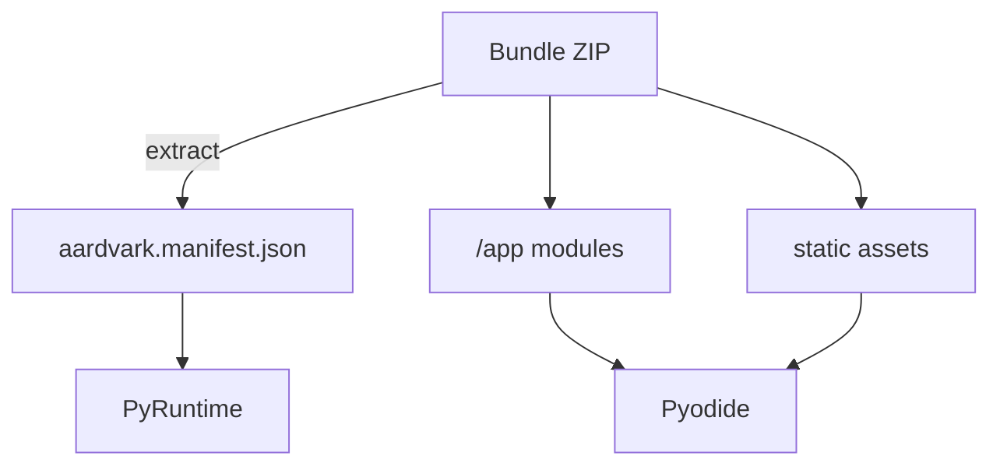
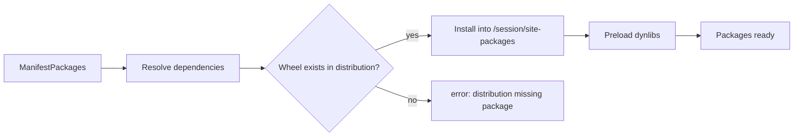
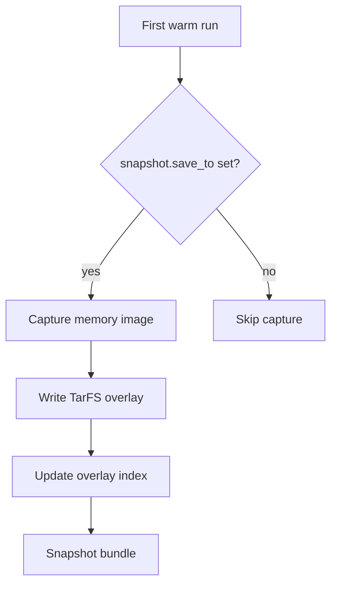

# Packages, Bundles, and Snapshots

This note explains how code and dependencies arrive in the runtime and how repeated invocations avoid cold-start penalties.

## Bundles

- Bundles are standard ZIP archives. `bundle.rs` rejects absolute paths, parent-directory escapes, and non-UTF8 names to keep mounting predictable.
- `aardvark.manifest.json` is optional but recommended. When missing, hosts must provide an `InvocationDescriptor` and package list manually.
- Python modules should live under `/app`. Supporting data files can be included as additional entries and accessed via `importlib.resources` or direct paths.

## Manifest-driven packages

- The manifest’s `packages` field lists [Pyodide](https://pyodide.org/) packages to preload. Names are normalised (trimmed, deduplicated, lowercase for comparisons).
- During session preparation the JS bootstrap resolves dependencies using [Pyodide](https://pyodide.org/)’s lockfile from the staged Aardvark Pyodide distribution and installs wheels from `AARDVARK_PYODIDE_DIST_DIR` (or the path set via `PyRuntimeConfig::with_pyodide_dist_dir`). The distribution manifest verifies the runtime files, package files, adapter version, lockfile hash, and compatibility fingerprint before use.
- Dynamic libraries required by those packages are preloaded immediately after installation so they remain available during snapshot capture and execution.

**Limitations**

- Manifests only support the bundled [Pyodide](https://pyodide.org/) version (currently `0.29.4`). Requests for a different version fail fast.
- Package installation still hits the local filesystem. Ensure hosts point `AARDVARK_PYODIDE_DIST_DIR` at a prepared distribution.

## Snapshots

- Passing `snapshot.load_from` in `PyRuntimeConfig` hydrates [Pyodide](https://pyodide.org/) from a previously captured memory snapshot, skipping import time.
- When `snapshot.save_to` is set, `PyRuntime::prepare_session_with_descriptor` writes a new snapshot after the first load, including overlay metadata.
- Snapshot exports generate:
  - the main memory image,
  - a snapshot sidecar with the active Pyodide compatibility fingerprint,
  - a content-addressed TarFS blob containing `/session/site-packages` and `/usr/lib` deltas,
  - a JSON index describing the overlay contents, preload instructions, and compatibility fingerprint.

**Limitations**

- Overlay hydration currently assumes a single overlay catalog per overlay cache root. Stale entries are ignored on fingerprint mismatch, but hosts must still coordinate manual pruning when deleting blobs out of band.
- Snapshots are architecture-specific. Do not share them across mismatched CPU features.
- Explicit snapshot loads, cached snapshot bytes, and `WarmState` restores fail when the compatibility fingerprint is missing or does not match the active distribution. Stale overlay catalog entries are ignored and rebuilt.

## Using Multiple Bundles

- `BundlePoolRegistry` routes each bundle/profile pair to its own warmed pool.
  Size `PoolOptions::desired_size` and `PoolOptions::max_size` for the
  concurrency each dependency set needs.
- Runtimes are not multi-tenant: only one session runs at a time within an isolate. Use additional pool capacity to parallelise.

## Alternative Loader Paths

- Hosts needing bespoke package resolution can skip the manifest packages and install requirements manually by calling into [Pyodide](https://pyodide.org/) through a custom strategy before handing control to user code.
- LangChain-style bundles with large optional dependencies can be shipped as separate snapshots; the manifest can reference the minimal package set and rely on the host to choose the right snapshot per request.
