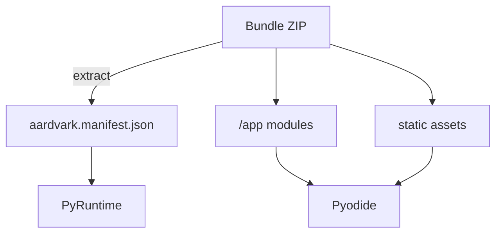
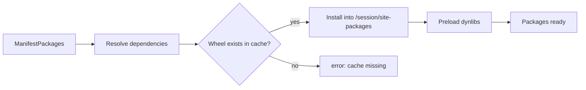
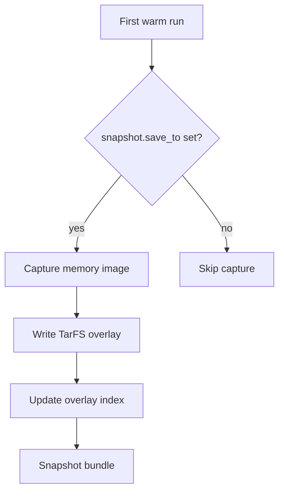

# Packages, Bundles, and Snapshots

This note explains how code and dependencies arrive in the runtime and how repeated invocations avoid cold-start penalties.

## Bundles

- Bundles are standard ZIP archives. `bundle.rs` rejects absolute paths, parent-directory escapes, and non-UTF8 names to keep mounting predictable.
- `aardvark.manifest.json` is optional but recommended. When missing, hosts must provide an `InvocationDescriptor` and package list manually.
- Python modules should live under `/app`. Supporting data files can be included as additional entries and accessed via `importlib.resources` or direct paths.

## Manifest-driven packages

- The manifest’s `packages` field lists Pyodide packages to preload. Names are normalised (trimmed, deduplicated, lowercase for comparisons).
- During session preparation the JS bootstrap resolves dependencies using Pyodide’s lockfile and installs wheels from the local cache referenced by `AARDVARK_PYODIDE_PACKAGE_DIR`.
- Dynamic libraries required by those packages are preloaded immediately after installation so they remain available during snapshot capture and execution.

**Limitations**

- Manifests only support the bundled Pyodide version (currently `0.28.2`). Requests for a different version fail fast.
- Package installation still hits the local filesystem. Ensure hosts point `AARDVARK_PYODIDE_PACKAGE_DIR` at a prepared cache.

## Snapshots

- Passing `snapshot.load_from` in `PyRuntimeConfig` hydrates Pyodide from a previously captured memory snapshot, skipping import time.
- When `snapshot.save_to` is set, `PyRuntime::prepare_session_with_descriptor` writes a new snapshot after the first load, including overlay metadata.
- Snapshot exports generate:
  - the main memory image,
  - a content-addressed TarFS blob containing `/session/site-packages` and `/usr/lib` deltas,
  - a JSON index describing the overlay contents and preload instructions.

**Limitations**

- Overlay hydration currently assumes a single overlay catalog. Hosts must coordinate manual cache invalidation when pruning blobs.
- Snapshots are architecture-specific. Do not share them across mismatched CPU features.

## Using Multiple Bundles

- A pool can warm multiple runtimes with different snapshots. Hosts should size `PoolConfig::max_runtimes` based on the concurrency they need per dependency set.
- Runtimes are not multi-tenant: only one session runs at a time within an isolate. Use additional pool capacity to parallelise.

## Alternative Loader Paths

- Hosts needing bespoke package resolution can skip the manifest packages and install requirements manually by calling into Pyodide through a custom strategy before handing control to user code.
- LangChain-style bundles with large optional dependencies can be shipped as separate snapshots; the manifest can reference the minimal package set and rely on the host to choose the right snapshot per request.
