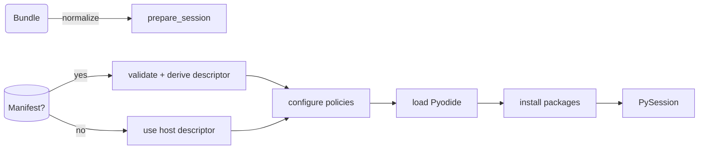
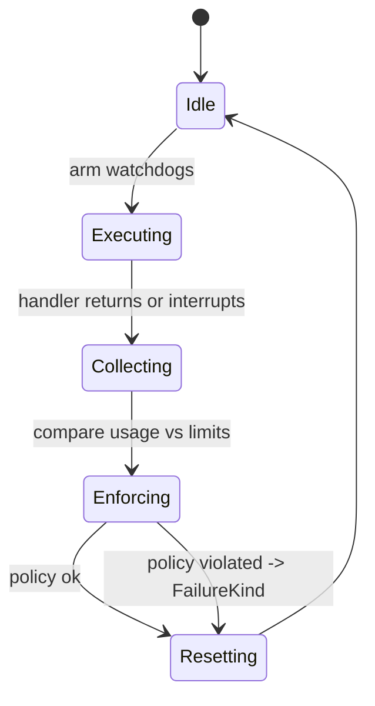

# Runtime Lifecycle

This guide follows a bundle from the moment the host hands it to a `PythonIsolate` (and its underlying `PyRuntime`) until the sandbox resets. Use it as the detailed companion to the high-level overview.

## 1. Runtime construction

- Hosts instantiate `PythonIsolate` directly or borrow one via `BundlePool`. These wrappers sit on top of `PyRuntime`. `IsolateConfig`/`PyRuntimeConfig` control snapshot paths, global budget overrides, cleanup policy, and default host capabilities.
- During `PyRuntime::new`, the runtime:
  - boots a dedicated V8 isolate,
  - registers embedded assets (Pyodide modules, bootstrap JS),
  - injects the bundled Pyodide version into the JS globals, and
  - stores an optional warm snapshot payload.

A runtime may stay idle in the pool until a bundle arrives. No Python code is loaded at this stage.

## 2. Session preparation

`prepare_session_with_manifest` is the common entry point (invoked by `PythonIsolate` after resolving the bundle). It performs the following:

1. Load and validate the manifest when present.
2. Derive an `InvocationDescriptor` (entrypoint, limits, inputs/outputs) and merge manifest resource hints.
3. Configure the JS layer with baseline policies:
   - network allowlist + HTTPS requirement,
   - filesystem mode (`read` or `readWrite`) and quota,
   - host capability gates (allowlist of native bridges).
4. Ensure Pyodide is loaded (from snapshot when available) and mount the bundle at `/app`.
5. Install requested packages through the Pyodide package loader and pre-stage dynamic libraries.

If a manifest is absent, the host may call `prepare_session_with_descriptor` after building the descriptor manually. Both paths produce a `PySession` which is an immutable handle containing the bundle and descriptor.

## 3. Invocation strategies

Execution always goes through a `PyInvocationStrategy` implementation:

- **Default strategy** – Calls `module:function(*decoded_inputs)` after decoding inputs based on descriptor metadata.
- **RawCtx strategy** – Exposes zero-copy buffers and metadata to Python via helper shims. Used when hosts call `run_session_with_strategy` directly.
- **Custom strategies** – Hosts can implement their own strategy to control argument marshalling or multi-step workflows.

Strategies receive an `InvocationContext` that grants controlled access to the JS runtime while maintaining sandbox invariants. They are also responsible for translating Python results into `ExecutionOutput` records.

## 4. Budget enforcement

Before entering Python code the runtime:

- Computes effective limits by merging descriptor limits with `PyRuntimeConfig::budget_override` (lower bound wins).
- Validates the current heap usage is under the limit.
- Starts a wall-clock watchdog that interrupts the isolate when exceeded.
- Records thread CPU time to compute `cpu_ms_used` on completion.

After the handler returns, the runtime re-checks heap usage and transforms policy breaches into structured failures (`TimeoutExceeded`, `CpuLimitExceeded`, `HeapLimitExceeded`).

## 5. Diagnostics collection

Regardless of success or failure the runtime collects:

- stdout/stderr buffers and exception metadata,
- CPU milliseconds used (if available from the platform),
- filesystem bytes written and violations emitted by the JS shim,
- allowed and denied network contacts,
- queue wait duration (populated by `BundlePool`) and queue wait distribution percentiles (P50, P95),
- `prepare_ms` / `cleanup_ms` timings, and
- the Python heap size in KiB (`py_heap_kib`) plus RSS snapshots when the platform reports them.

`ExecutionOutcome::sandbox_telemetry()` converts these into host-facing `SandboxTelemetry` objects so hosts can record metrics or trigger alerts.

## 6. Reset and reuse

- If `ResetPolicy::AfterInvocation` is configured, the runtime automatically rolls back to the warm snapshot before returning from `run_session`.
- If `ResetPolicy::Manual` is used (the pooling-friendly default), callers decide when to invoke `reset_to_snapshot`/`reset_in_place`.
- `BundlePool` fans out requests across a configurable number of isolates. Calls waiting on the queue resume as soon as an isolate becomes idle, keeping resets transparent to the host.
- Each reset (manual or in-place) records `mode`, `duration_ms`, and `engine_generation` so the next invocation’s diagnostics expose how the runtime was scrubbed.
- Warm states captured inside the runtime mark their overlays as preloaded, allowing in-place resets to skip the expensive overlay import entirely.

## Failure Modes and Recovery

- **Bootstrap failures** (bad manifests, missing entrypoints, package installation errors) surface as `PyRunnerError` during session preparation. Hosts should treat them as deployment-time failures.
- **Policy violations** (network deny, filesystem errors) are recorded and returned in diagnostics; the Python code may still succeed unless the violation caused the call to abort.
- **Runtime panics** in JS/V8 propagate as `PyRunnerError::Internal` and should be treated as fatal; the runtime instance should be discarded.
- **Memory guard rails** quarantine isolates that exceed the configured heap or RSS limits. Quarantined isolates are dropped and replaced automatically.

## Outstanding Gaps

- Wall-clock watchdog relies on cooperative interruption by Pyodide; heavy native extensions may not obey it.
- CPU accounting uses per-thread timers which some targets disable. When absent the runtime skips enforcement and reports `None` for `cpu_ms_used`.
- Guard rail telemetry for RSS depends on platform support (Linux uses `/proc/self/statm`; macOS relies on `mach_task_basic_info`; other targets still report `None`).
