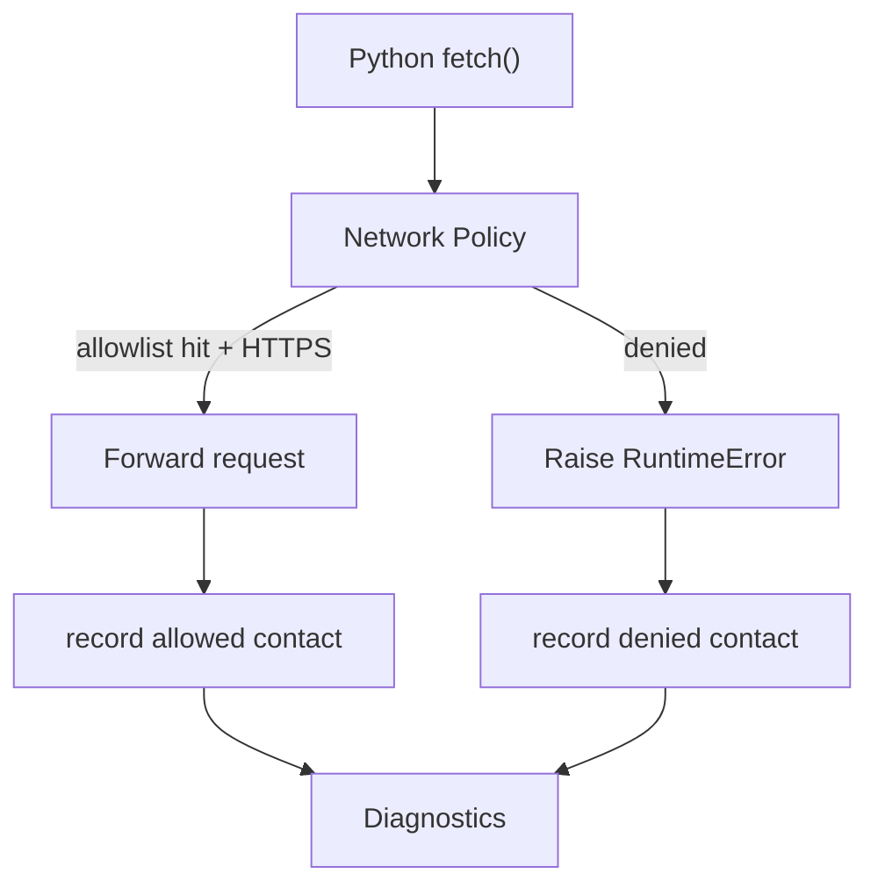
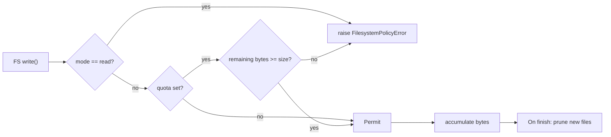
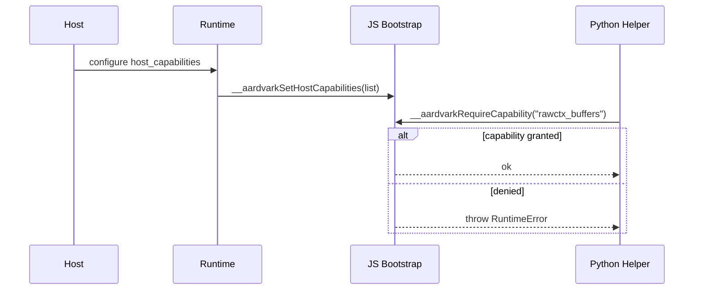

# Sandboxing Model

This document captures how Aardvark limits resource access from Python code.

## Network

- Policies are configured per session via `JsRuntime::set_network_policy`, driven by manifest `resources.network` or host overrides.
- Allowlist entries support exact hosts (`api.example.com`) and wildcard suffixes (`*.example.com`). Optional `:<port>` qualifiers narrow matches.
- HTTPS is mandatory unless the manifest explicitly sets `httpsOnly` to `false`.
- Every outbound fetch records whether it was allowed or blocked. Blocked requests surface with a reason (`no-allowlist`, `scheme-not-allowed`, `host-not-allowed`).
- Denied requests throw into Python as `RuntimeError` with the same reason, so handlers can choose to catch them.

**Limitations**

- Only fetch-style requests are intercepted today. Direct socket access is not exposed, but if Pyodide gains new networking backdoors they still need to be patched into the shim.
- DNS resolution is not measured. Hosts may want to proxy network access when audit-grade logging is required.

## Filesystem

- User bundles mount at `/app`. Pyodide’s standard runtime mounts `/lib`, `/usr`, etc.; these remain read-only.
- The JS shim tracks writes under `/session` via virtual `FS` hooks. Hosts can choose `read` or `readWrite` mode per manifest.
- When writable mode is enabled, an optional quota (bytes written) can be set. Attempting to write beyond the quota raises `FilesystemPolicyError` inside Python.
- On every invocation finish the shim enumerates new/changed files and deletes them to leave the session clean.

**Limitations**

- Quota enforcement is best-effort; it tracks bytes written via the virtual FS layer and does not distinguish truncations versus overwrites.
- Filesystem cleanup is scoped to `/session`. If we ever allow additional writable mounts they must be registered with the shim explicitly.

## Host Capabilities

- Native hooks (RawCtx buffer bridge, future host APIs) are guarded by string capabilities.
- `PyRuntimeConfig.host_capabilities` defines the default allowlist. Manifests may request extra capabilities via `resources.hostCapabilities`; host integrations may further filter the list before calling `apply_host_capabilities`.
- The JS bootstrap exposes `__aardvarkRequireCapability(name)` which throws if the capability was not granted. Python glue calls this before touching native hooks.

**Limitations**

- Only the `rawctx_buffers` capability exists today. Additional host APIs must come with their own capability names and enforcement using the same mechanism.
- Capability denial currently surfaces as `RuntimeError`. Hosts needing structured errors can wrap the invocation result and inspect diagnostics.

## CPU and Wall Watchdogs

- Wall-clock limits rely on the JS engine’s interrupt mechanism. Once triggered, the Python handler receives a `RuntimeError` and execution stops.
- CPU budgeting is handled in Rust using per-thread CPU timers. The runtime aborts post-execution if the measured CPU milliseconds exceed the limit.

**Limitations**

- CPU timers are not available on all targets. When the platform does not supply `thread_cpu_time_ns`, CPU limits can’t be enforced.
- There is no sampling profiler integration yet; only aggregate CPU milliseconds are reported.
