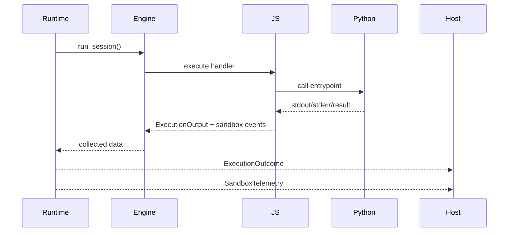
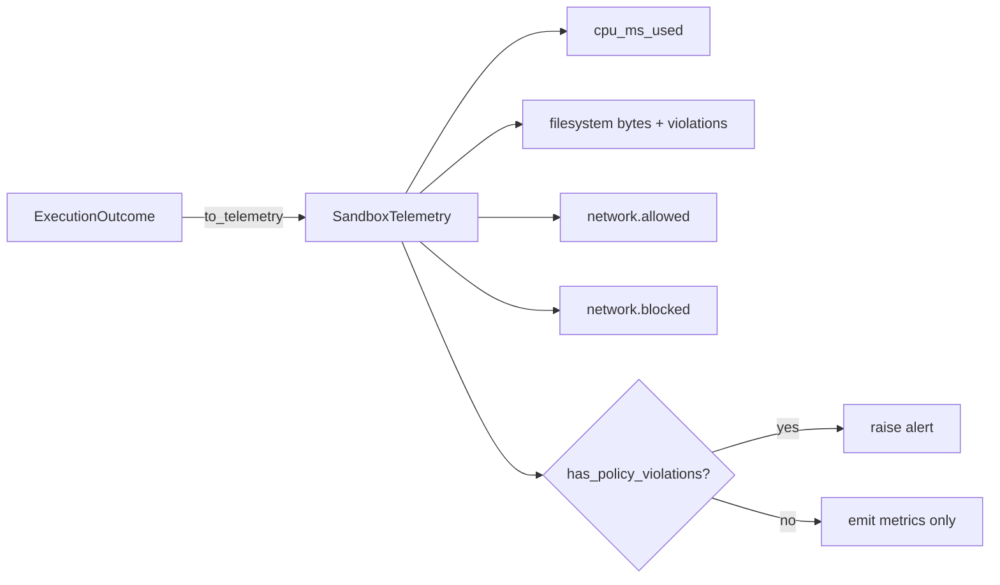

# Telemetry and Observability

Aardvark emphasises structured diagnostics so hosts can make admission and billing decisions without scraping logs.

## ExecutionOutcome

Every invocation returns an `ExecutionOutcome` containing:

- `status` – `Success` with a payload (text, JSON, binary, shared buffers) or `Failure` with a specific `FailureKind`.
- `diagnostics` – stdout, stderr, optional Python exception (`type`, `value`, `traceback`), plus sandbox metrics.

Hosts should persist the full diagnostics blob for debugging. For latency-sensitive workflows, prefer extracting telemetry summaries as described below.

## SandboxTelemetry

`ExecutionOutcome::sandbox_telemetry()` produces a `SandboxTelemetry` struct:

- `queue_wait_ms` – Milliseconds spent waiting for a pooled isolate (if the call went through `BundlePool`).
- `cpu_ms_used` – CPU milliseconds consumed by the Python thread (if available).
- `prepare_ms` / `cleanup_ms` – Host-visible timings for the runtime’s prepare and cleanup phases.
- `filesystem.bytes_written` – Bytes written under `/session` during the invocation.
- `filesystem.violations` – Any attempts that breached filesystem policy.
- `network.allowed` / `network.blocked` – Lists of contacted hosts and denied requests, including port, HTTPS flag, and reason codes.
- `py_heap_kib` – Python heap usage at the end of the invocation (KiB).

The telemetry snapshot is cheap to clone and is intended for metrics pipelines (Prometheus, statsd, etc.).

## Tracing

The runtime ships with tracing instrumentation (`tracing` crate):

- Runtime lifecycle: `runtime.new`, `runtime.pool.checkout`, `runtime.pool.return`, `runtime.reset`.
- Budgeting: `aardvark::budget` spans outlining limits and enforcement results.
- Diagnostics: `aardvark::diagnostics` logs CPU usage, filesystem writes, and network decisions.

Integrations can subscribe via `tracing-subscriber` to feed logs into structured collectors. The emitted fields (`runtime_id`, `entrypoint`, host/port) are stable.

## FailureKinds

Failures differentiate between:

- `PythonException` – Python raised and was not caught.
- `AdapterError` – Invocation strategy failed before Python executed (e.g., decoder error).
- `TimeoutExceeded`, `CpuLimitExceeded`, `HeapLimitExceeded` – policy breaches.
- `Other` – unrecoverable runtime errors (JS engine failures, reset issues).

Hosts should treat adapter and other failures as infrastructure incidents; policy failures belong to the bundle author.

## Diagnostics Roadmap

The following telemetry gaps remain open:

- No heap usage metrics beyond the hard fail when limits are exceeded. Capturing peak heap usage is on the backlog.
- Filesystem telemetry does not list the filenames written; only aggregate bytes and violation messages are provided.
- There is no streaming log channel; all stdout/stderr is buffered until completion.

Any host SDKs should leave room to expose additional counters in a backwards-compatible fashion.
