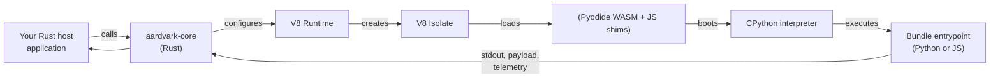
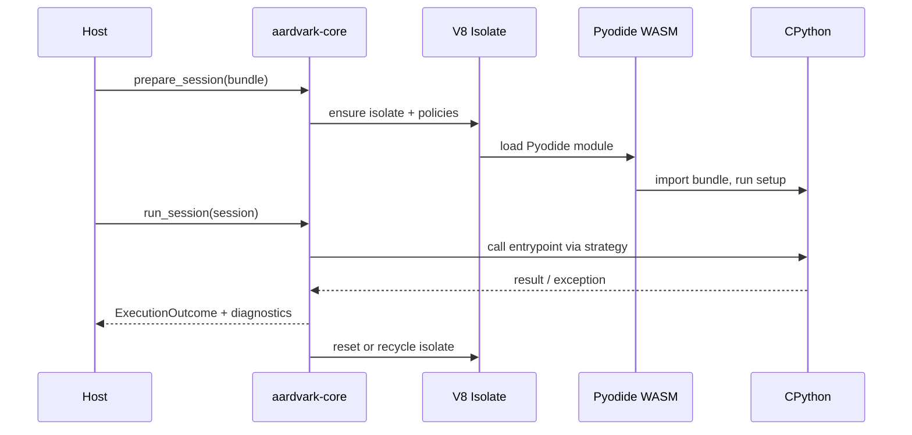

# What This Runtime Actually Does

Start here for the runtime shape: how a Python or JavaScript bundle gets from a
ZIP file to a V8 isolate, and where the host boundary sits.

## Big Picture

At runtime we embed [V8](https://v8.dev/) (Google’s JavaScript engine) inside a Rust library. [Pyodide](https://pyodide.org/) (a WebAssembly build of CPython) runs *inside* that V8 instance so Python code can execute without shipping a browser.

### Layers

1. **Host (you)** – Link `aardvark-core` and decide when to prepare/run bundles.
2. **Core runtime** – Rust code that builds sessions, enforces policies, and collects telemetry.
3. **[V8](https://v8.dev/)** – Owns the isolate and the JavaScript execution context.
4. **[Pyodide](https://pyodide.org/) WASM + shims** – WebAssembly binary plus JavaScript glue that exposes filesystem/network guards to the interpreter.
5. **CPython** – The actual Python VM running inside Pyodide.
6. **Bundle entrypoint** – The function from your ZIP bundle (`module:function`) returning JSON, RawCtx buffers, or nothing.

## Lifecycle in 30 Seconds

## Isolation Model

- **Single process** – V8 isolates, WebAssembly, and JS shims are the in-process
  guard rails. They are not a substitute for a process, container, or VM
  boundary.
- **Warm reuse** – Pools and warmed hosts reuse Pyodide init, package imports,
  and handler preparation without changing the bundle fingerprint or active
  distribution profile.
- **Policy enforcement** – Filesystem, network, and host-hook checks live in the
  JS shims and are mirrored in Rust diagnostics.

## What You Need To Deploy It

- Ship bundles as ZIP files with an optional `aardvark.manifest.json`.
- Provide a staged Aardvark Pyodide distribution on disk when Python bundles need packages – the runtime never downloads wheels on the fly.
- Decide on invocation strategy: JSON (serde-friendly) or RawCtx (zero-copy buffers).
- Monitor `ExecutionOutcome.diagnostics` for policy hits; guard rails are surfaced there first.

For the full execution path, see `docs/architecture/overview.md` and
`docs/architecture/lifecycle.md`.
