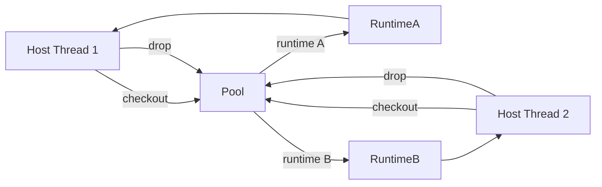

# Runtime Internals

This document complements the public architecture notes with developer-oriented
information about the moving parts you are likely to touch.

## High-Level Stack

1. **Rust runtime (`crates/aardvark-core/src/runtime.rs`)** – orchestrates
   session preparation, watchdogs, and diagnostics.
2. **JS engine wrapper (`crates/aardvark-core/src/engine.rs`)** – embeds [V8](https://v8.dev/) and
  exposes a safe Rust façade for evaluating scripts, mounting bundles, and
  configuring policies.
3. **Bootstrap assets (`crates/aardvark-core/src/js/`)** – JavaScript injected
   into [Pyodide](https://pyodide.org/) to enforce sandboxing and provide host hooks.
4. **Python support (`crates/aardvark-core/src/py/`)** – small utilities copied
   into the virtual filesystem to patch [Pyodide](https://pyodide.org/) behaviour where necessary.

## Rust ↔ JS Bridge

- The bridge is synchronous and single-threaded. Every call into [V8](https://v8.dev/) happens on
  the runtime thread; we rely on `v8::Locker` to guard isolates.
- `JsRuntime` caches compiled modules ([Pyodide](https://pyodide.org/), bootstrap scripts) and exposes
  helpers for calling specific exported functions.
- Errors from JS are converted into `PyRunnerError::Execution` with rich
  context. When changing bindings, keep failure modes actionable.

## Pyodide Bootstrap

- Entry point is `pyodide_bootstrap.js`. It mounts packages, wires network and
  filesystem policies, and exposes capability guards.
- The bootstrap exports a small API that Rust calls through `JsRuntime`:
  - `loadPyodide(opts)`
  - `setNetworkPolicy(allow, httpsOnly)`
  - `setFilesystemPolicy(mode, quota)`
  - `executeInvocation(descriptor, strategy)`
- When adding new host capabilities, introduce string constants in both the JS
  and Rust sides. The policy list flows from manifest → runtime → JS shim.

## Sandbox Events

- Network contacts, blocked hosts, filesystem writes, and violations are recorded
  inside the JS layer and drained by Rust after execution.
- When extending telemetry, update:
  - `CollectedDiagnostics` in `runtime.rs`
  - `Diagnostics` and `SandboxTelemetry` in `outcome.rs` / `host.rs`
  - Any integration tests using `assert_eq!` on diagnostics.

## CPU and Wall Watchdogs

- Wall watchdog uses [V8](https://v8.dev/)’s interrupt mechanism. The guard object returned by
  `arm_watchdog` must be dropped explicitly to avoid spurious interrupts.
- CPU measurement relies on `thread_cpu_time_ns()` from `std::time::Instant`.
  Platforms that lack it return `None`, so code should handle the absence
  gracefully.

## Snapshot Lifecycle

- `PyRuntime::load_snapshot_bytes` reads optional snapshots configured via
  `PyRuntimeConfig`.
- Resetting to snapshots happens either explicitly (pool drop path) or after
  each invocation when `ResetPolicy::AfterInvocation` is set.
- If initialization fails, the runtime is considered tainted. Drop it and let
  the pool replace it.

## JS Asset Updates

- After editing JS files, run `npm run lint:js` (or equivalent) and ensure the
  assets still load in Node. The JS bundle is not transpiled; stick to syntax
  supported by the embedded [V8](https://v8.dev/) version.
- Keep modules self-contained: no dynamic `import()` without embedding the
  dependency alongside the bootstrap file.

## Python Helpers

- Located under `crates/aardvark-core/src/py/`. These patches adjust behaviour
  such as entropy sources or dynamic imports.
- When updating, regenerate the hashed asset list if necessary (see comments in
  `assets.rs`).

## Adding New Capabilities or Policies

1. Extend the manifest schema and Rust types.
2. Update JS bootstrap to enforce the policy.
3. Surface telemetry back into `Diagnostics`.
4. Document the behaviour in `docs/architecture` and `docs/api`.
5. Add integration tests to prevent regressions.

Following this order keeps host APIs and in-process behaviour aligned.

## Benchmarking Basics

- `cargo run -p aardvark-core --example bench_echo -- [iterations] [payload_len]` exercises a tiny Python echo handler and prints per-phase timings (`prepare`, `run`, `total`).
- The harness captures a warm snapshot up-front, so in-place resets hit the fast path (overlay already baked into the snapshot).
- Adjust `payload_len` to explore how return sizes influence the execution phase; the `prepare` measurement stays dominated by warm-restore.

## Threading & Pooling Model

- **Single-threaded core.** `JsRuntime` owns a [V8](https://v8.dev/) isolate; every call into the engine must happen on the same OS thread that created it. The runtime is not `Send`/`Sync`, and `v8::Locker` guards the isolate.
- **Host-driven parallelism.** To run handlers concurrently, hosts create or pool multiple runtimes—one per worker thread (or process). Each checkout stays on the borrowing thread until it is dropped.
- **Pooling vs. manual reuse.** If you only run sequential invocations, holding a `PyRuntime` and calling `reset_in_place()` yourself is equivalent to pooling. Pools add value when you need lifecycle isolation (drop tainted runtimes) or multiple threads sharing a limited set of isolates.
- **No implicit async.** Aardvark does not spawn worker threads or background reset tasks; everything is synchronous. If you wrap it in async code, use `spawn_blocking` or your own thread pool.

1. Host threads check out runtimes when they need to execute a bundle. If none are available, they block.
2. The runtime is used entirely on that thread (`prepare_session`, `run_session`). Moving it to another thread is undefined behaviour.
3. Dropping the handle returns it to the pool, which performs the configured reset (in-place or full rebuild) before making it available again.

🚫 **Do not** move `PyRuntime` or `PooledRuntime` values across threads. Need cross-thread execution? Spawn a dedicated worker thread per runtime and communicate via channels in your host layer.
